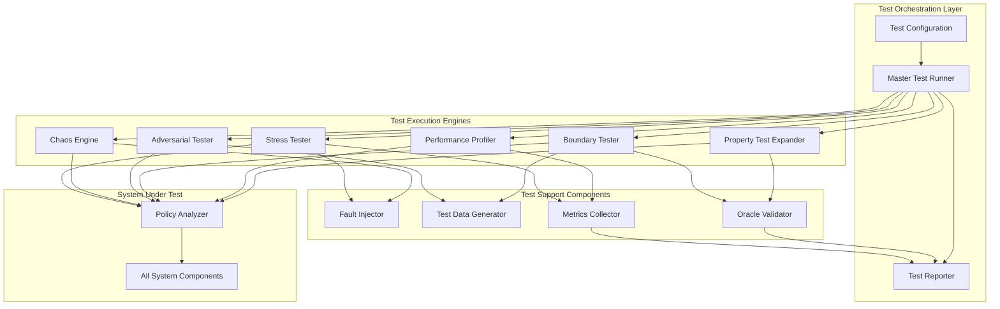

# Design Document: Comprehensive Hardest Testing

## Overview

The Comprehensive Hardest Testing feature adds extreme, adversarial, and chaos testing capabilities to the Offline Policy Gap Analyzer. This testing suite validates system behavior under maximum stress, fault injection, security attacks, and edge cases that go far beyond standard testing approaches.

The design introduces a multi-layered testing framework that systematically breaks the system in every conceivable way to identify weaknesses, validate graceful degradation, and ensure robustness under real-world adversarial conditions. The framework includes:

- **Stress Testing**: Maximum load scenarios with 100-page documents, 500k words, 10k+ chunks, and concurrent operations
- **Chaos Engineering**: Fault injection including disk failures, memory exhaustion, corruption, and process interruptions
- **Security Testing**: Adversarial inputs including malicious PDFs, injection attacks, buffer overflows, and path traversal
- **Boundary Testing**: Edge cases with empty documents, extreme structures, encoding attacks, and coverage boundaries
- **Performance Profiling**: Degradation curves, bottleneck identification, and baseline establishment
- **Property-Based Testing Expansion**: 10x more test cases with aggressive strategies
- **Metamorphic Testing**: Input-output relationship validation
- **Comprehensive Validation**: Invariants, oracles, and reproducibility testing

This testing framework operates as a separate test harness that exercises the existing Policy Analyzer system without modifying its core functionality. The goal is to discover failure modes, document breaking points, and validate that the system degrades gracefully under extreme conditions.

## Architecture

### High-Level Architecture



### Component Responsibilities

**Master Test Runner**
- Orchestrates execution of all test categories
- Manages test execution order and dependencies
- Aggregates results from all test engines
- Generates comprehensive test reports
- Provides CLI interface for selective test execution

**Stress Tester**
- Executes maximum load scenarios (100-page docs, 500k words, 10k+ chunks)
- Tests concurrent operations (5+ simultaneous analyses)
- Measures resource consumption (memory, CPU, disk I/O)
- Identifies breaking points and performance cliffs
- Validates resource leak detection

**Chaos Engine**
- Injects faults at all pipeline stages
- Simulates disk full, memory exhaustion, corruption
- Tests process interruption (SIGINT, SIGTERM, SIGKILL)
- Validates file system permission errors
- Tests configuration chaos scenarios

**Adversarial Tester**
- Tests malicious PDF files (embedded JavaScript, malformed structure, recursive references)
- Validates buffer overflow protection (extremely long inputs)
- Tests encoding attacks (null bytes, Unicode control characters, mixed encodings)
- Validates path traversal protection
- Tests prompt injection resistance

**Boundary Tester**
- Tests empty and whitespace-only documents
- Validates structural anomalies (no headings, 100+ nesting levels, inconsistent hierarchy)
- Tests extreme coverage boundaries (0 gaps, 49 gaps, exact threshold scores)
- Validates encoding and character set handling (Chinese, Arabic, Cyrillic, emoji)
- Tests similarity score boundaries

**Performance Profiler**
- Measures performance degradation curves (1 to 100 pages)
- Identifies bottlenecks in the analysis pipeline
- Establishes performance baselines on consumer hardware
- Generates performance comparison reports
- Tracks performance trends over time

**Property Test Expander**
- Expands existing property tests with 10x more cases
- Uses Hypothesis aggressive search strategies
- Tests all invariants with randomly generated inputs
- Tests all round-trip properties with extreme inputs
- Saves failing examples for regression testing

**Fault Injector**
- Provides mechanisms for simulating system failures
- Supports disk full, memory exhaustion, corruption injection
- Enables process interruption at arbitrary points
- Simulates file system permission errors
- Injects delays and resource contention

**Test Data Generator**
- Generates synthetic policy documents with configurable characteristics
- Creates malicious PDF files for security testing
- Generates documents with intentional gaps at specific CSF subcategories
- Creates documents with extreme structural properties
- Generates documents with diverse character sets and encodings

**Metrics Collector**
- Collects performance metrics (time, memory, CPU, disk I/O)
- Tracks resource consumption over time
- Detects resource leaks
- Measures degradation curves
- Stores metrics for baseline comparison

**Oracle Validator**
- Maintains known-good test cases with expected outputs
- Validates analysis accuracy against oracle results
- Measures false positive and false negative rates
- Tracks accuracy trends over time
- Updates oracles when system behavior intentionally changes

### Integration with Existing System

The testing framework operates as a separate test harness that exercises the existing Policy Analyzer without modifying its core functionality. The integration points are:

1. **Test Execution**: Tests invoke the Policy Analyzer through its public API (orchestration.analysis_pipeline)
2. **Configuration**: Tests use the existing configuration system (utils.config_loader) with test-specific overrides
3. **Monitoring**: Tests observe system behavior through logging, metrics, and output validation
4. **Fault Injection**: Tests use OS-level mechanisms (resource limits, signal handling, file system manipulation) to inject faults

The testing framework does not modify the Policy Analyzer's code, ensuring that test results reflect production behavior.

## Components and Interfaces

### Master Test Runner

**Purpose**: Orchestrate execution of all test categories and generate comprehensive reports.

**Interface**:
```python
class MasterTestRunner:
    def __init__(self, config: TestConfig):
        """Initialize with test configuration."""
        
    def run_all_tests(self) -> TestReport:
        """Execute all test categories and return comprehensive report."""
        
    def run_category(self, category: str) -> CategoryReport:
        """Execute specific test category (stress, chaos, adversarial, boundary, performance)."""
        
    def run_requirement(self, requirement_id: str) -> RequirementReport:
        """Execute tests for specific requirement."""
        
    def generate_report(self, results: List[TestResult]) -> TestReport:
        """Generate comprehensive test report with pass/fail status."""
```

**Key Responsibilities**:
- Parse test configuration and command-line arguments
- Initialize all test engines with appropriate configurations
- Execute tests in dependency order
- Aggregate results from all test engines
- Generate HTML and JSON test reports
- Provide progress indicators during execution
- Handle test failures and continue execution

### Stress Tester

**Purpose**: Validate system behavior under maximum load and resource constraints.

**Interface**:
```python
class StressTester:
    def __init__(self, metrics_collector: MetricsCollector):
        """Initialize with metrics collector."""
        
    def test_maximum_document_size(self) -> TestResult:
        """Test with 100-page PDF, 500k words, 10k+ chunks."""
        
    def test_concurrent_operations(self, concurrency: int) -> TestResult:
        """Test with N concurrent analysis operations."""
        
    def test_resource_leaks(self, iterations: int) -> TestResult:
        """Execute N analyses and verify no resource leaks."""
        
    def test_reference_catalog_scale(self, catalog_size: int) -> TestResult:
        """Test with reference catalogs containing N subcategories."""
        
    def identify_breaking_point(self, dimension: str) -> BreakingPoint:
        """Identify maximum viable value for dimension (doc_size, chunk_count, etc.)."""
```

**Key Responsibilities**:
- Generate or load maximum-size test documents
- Execute concurrent analyses with thread safety validation
- Monitor memory usage, CPU utilization, disk I/O
- Detect resource leaks (memory, file handles, threads)
- Identify breaking points for various dimensions
- Measure performance degradation with increasing load

### Chaos Engine

**Purpose**: Inject faults and simulate failure scenarios to validate error handling.

**Interface**:
```python
class ChaosEngine:
    def __init__(self, fault_injector: FaultInjector):
        """Initialize with fault injector."""
        
    def test_disk_full(self, injection_point: str) -> TestResult:
        """Simulate disk full at specific pipeline stage."""
        
    def test_memory_exhaustion(self, limit_mb: int) -> TestResult:
        """Simulate memory exhaustion with specified limit."""
        
    def test_model_corruption(self, model_type: str) -> TestResult:
        """Test with corrupted model files."""
        
    def test_process_interruption(self, signal: str, injection_point: str) -> TestResult:
        """Test process interruption at specific point."""
        
    def test_permission_errors(self, path_type: str) -> TestResult:
        """Test file system permission errors."""
        
    def test_configuration_chaos(self, invalid_config: Dict) -> TestResult:
        """Test with invalid configuration combinations."""
```

**Key Responsibilities**:
- Inject faults at all pipeline stages
- Simulate disk full scenarios during output generation, audit logging, vector store persistence
- Simulate memory exhaustion during LLM inference, embedding generation
- Test with corrupted model files and vector stores
- Simulate process interruptions (SIGINT, SIGTERM, SIGKILL)
- Test file system permission errors
- Validate error messages and cleanup operations

### Adversarial Tester

**Purpose**: Test security boundaries with malicious inputs and attack vectors.

**Interface**:
```python
class AdversarialTester:
    def __init__(self, test_data_gen: TestDataGenerator):
        """Initialize with test data generator."""
        
    def test_malicious_pdfs(self) -> TestResult:
        """Test with 20+ malicious PDF samples."""
        
    def test_buffer_overflow(self) -> TestResult:
        """Test with extremely long inputs."""
        
    def test_encoding_attacks(self) -> TestResult:
        """Test with special characters and encoding attacks."""
        
    def test_path_traversal(self) -> TestResult:
        """Test with 10+ path traversal attack patterns."""
        
    def test_prompt_injection(self) -> TestResult:
        """Test with 15+ prompt injection patterns."""
        
    def test_chunking_boundary_attacks(self) -> TestResult:
        """Test with adversarial chunking scenarios."""
```

**Key Responsibilities**:
- Generate or load malicious PDF files (embedded JavaScript, malformed structure, recursive references)
- Test buffer overflow protection with extremely long inputs
- Test encoding attacks (null bytes, Unicode control characters, mixed encodings)
- Validate path traversal protection
- Test prompt injection resistance in Stage B reasoning
- Test chunking boundary attacks (CSF references split across chunks)
- Validate input sanitization and escaping

### Boundary Tester

**Purpose**: Validate edge cases and extreme input conditions.

**Interface**:
```python
class BoundaryTester:
    def __init__(self, test_data_gen: TestDataGenerator, oracle: OracleValidator):
        """Initialize with test data generator and oracle validator."""
        
    def test_empty_documents(self) -> TestResult:
        """Test with empty and whitespace-only documents."""
        
    def test_structural_anomalies(self) -> TestResult:
        """Test with extreme document structures."""
        
    def test_coverage_boundaries(self) -> TestResult:
        """Test with policies at exact coverage thresholds."""
        
    def test_encoding_diversity(self) -> TestResult:
        """Test with 10+ different languages and character sets."""
        
    def test_similarity_score_boundaries(self) -> TestResult:
        """Test with scores at 0.0, 0.3, 0.5, 0.8, 1.0."""
```

**Key Responsibilities**:
- Test empty and whitespace-only documents
- Test structural anomalies (no headings, 100+ nesting levels, inconsistent hierarchy)
- Test extreme coverage boundaries (0 gaps, 49 gaps, exact threshold scores)
- Test encoding and character set handling (Chinese, Arabic, Cyrillic, emoji)
- Test similarity score boundaries and classification thresholds
- Validate minimum viable document size
- Test extreme chunk overlap configurations

### Performance Profiler

**Purpose**: Measure performance degradation curves and identify bottlenecks.

**Interface**:
```python
class PerformanceProfiler:
    def __init__(self, metrics_collector: MetricsCollector):
        """Initialize with metrics collector."""
        
    def profile_document_size_scaling(self) -> PerformanceReport:
        """Measure performance for documents from 1 to 100 pages."""
        
    def profile_chunk_count_scaling(self) -> PerformanceReport:
        """Measure performance for 10 to 10,000 chunks."""
        
    def profile_llm_context_scaling(self) -> PerformanceReport:
        """Measure LLM inference time for prompts from 100 to 10,000 tokens."""
        
    def identify_bottlenecks(self) -> List[Bottleneck]:
        """Identify bottlenecks in the analysis pipeline."""
        
    def establish_baselines(self) -> BaselineMetrics:
        """Establish performance baselines on consumer hardware."""
        
    def generate_degradation_graphs(self) -> List[Graph]:
        """Generate performance degradation graphs."""
```

**Key Responsibilities**:
- Measure analysis time for documents from 1 to 100 pages
- Measure memory usage for documents from 1 to 100 pages
- Measure embedding generation time for 10 to 10,000 chunks
- Measure LLM inference time for prompts from 100 to 10,000 tokens
- Identify performance cliffs (non-linear degradation)
- Establish performance baselines on consumer hardware (8-16GB RAM)
- Generate performance degradation graphs and reports
- Track performance trends over time

### Property Test Expander

**Purpose**: Expand existing property-based tests with aggressive strategies.

**Interface**:
```python
class PropertyTestExpander:
    def __init__(self, oracle: OracleValidator):
        """Initialize with oracle validator."""
        
    def expand_existing_properties(self, multiplier: int = 10) -> TestResult:
        """Expand existing property tests with N times more cases."""
        
    def test_invariants(self) -> TestResult:
        """Test all system invariants with random inputs."""
        
    def test_round_trip_properties(self) -> TestResult:
        """Test all round-trip properties with extreme inputs."""
        
    def test_metamorphic_properties(self) -> TestResult:
        """Test metamorphic relationships between inputs and outputs."""
        
    def save_failing_examples(self, examples: List[FailingExample]) -> None:
        """Save failing examples for regression testing."""
```

**Key Responsibilities**:
- Expand existing property tests with 10x more test cases
- Use Hypothesis aggressive search strategies (e.g., @settings(max_examples=1000))
- Test all invariants with randomly generated inputs
- Test all round-trip properties with extreme inputs
- Test metamorphic properties (document extension decreases gaps, formatting changes preserve results)
- Save all failing examples for regression testing
- Verify property tests complete within 5 minutes per property

### Fault Injector

**Purpose**: Provide mechanisms for simulating system failures.

**Interface**:
```python
class FaultInjector:
    def inject_disk_full(self, path: str, threshold_bytes: int) -> ContextManager:
        """Simulate disk full at specified path."""
        
    def inject_memory_limit(self, limit_mb: int) -> ContextManager:
        """Simulate memory limit."""
        
    def inject_corruption(self, file_path: str, corruption_type: str) -> None:
        """Corrupt specified file."""
        
    def inject_signal(self, signal: str, delay_seconds: float) -> None:
        """Send signal to current process after delay."""
        
    def inject_permission_error(self, path: str) -> ContextManager:
        """Simulate permission error at specified path."""
        
    def inject_delay(self, operation: str, delay_seconds: float) -> ContextManager:
        """Inject delay for specified operation."""
```

**Key Responsibilities**:
- Provide context managers for fault injection
- Simulate disk full using OS-level mechanisms (e.g., ulimit, quota)
- Simulate memory limits using resource.setrlimit
- Corrupt files by modifying bytes, truncating, or deleting
- Send signals (SIGINT, SIGTERM, SIGKILL) to processes
- Simulate permission errors by changing file modes
- Inject delays to simulate slow operations
- Clean up after fault injection

### Test Data Generator

**Purpose**: Generate diverse test data for comprehensive testing.

**Interface**:
```python
class TestDataGenerator:
    def generate_policy_document(self, spec: DocumentSpec) -> str:
        """Generate synthetic policy document with specified characteristics."""
        
    def generate_malicious_pdf(self, attack_type: str) -> bytes:
        """Generate malicious PDF for security testing."""
        
    def generate_gap_policy(self, gap_subcategories: List[str]) -> str:
        """Generate policy with intentional gaps at specified subcategories."""
        
    def generate_extreme_structure(self, structure_type: str) -> str:
        """Generate document with extreme structural properties."""
        
    def generate_multilingual_document(self, languages: List[str]) -> str:
        """Generate document with diverse character sets."""
```

**Key Responsibilities**:
- Generate synthetic policy documents with configurable size, structure, coverage
- Generate malicious PDF files (embedded JavaScript, malformed structure, recursive references)
- Generate documents with intentional gaps at specific CSF subcategories
- Generate documents with extreme structural properties (no headings, 100+ nesting, 1000+ sections)
- Generate documents with diverse character sets (Chinese, Arabic, Cyrillic, emoji)
- Provide CLI for creating custom test cases
- Cache generated test data for reuse

### Metrics Collector

**Purpose**: Collect and store performance metrics for analysis.

**Interface**:
```python
class MetricsCollector:
    def start_collection(self, test_id: str) -> None:
        """Start collecting metrics for test."""
        
    def stop_collection(self, test_id: str) -> Metrics:
        """Stop collecting metrics and return results."""
        
    def collect_memory_usage(self) -> float:
        """Collect current memory usage in MB."""
        
    def collect_cpu_usage(self) -> float:
        """Collect current CPU usage percentage."""
        
    def collect_disk_io(self) -> DiskIOMetrics:
        """Collect disk I/O metrics."""
        
    def detect_resource_leak(self, baseline: Metrics, current: Metrics) -> Optional[ResourceLeak]:
        """Detect resource leaks by comparing metrics."""
        
    def store_baseline(self, name: str, metrics: Metrics) -> None:
        """Store baseline metrics for regression detection."""
```

**Key Responsibilities**:
- Collect performance metrics (time, memory, CPU, disk I/O)
- Track resource consumption over time
- Detect resource leaks (memory, file handles, threads)
- Measure degradation curves
- Store metrics for baseline comparison
- Generate performance comparison reports
- Alert when performance degrades more than 20% from baseline

### Oracle Validator

**Purpose**: Validate analysis accuracy against known-good test cases.

**Interface**:
```python
class OracleValidator:
    def __init__(self, oracle_dir: str):
        """Initialize with directory containing oracle test cases."""
        
    def load_oracles(self) -> List[OracleTestCase]:
        """Load all oracle test cases."""
        
    def validate_against_oracle(self, test_case: OracleTestCase, result: GapAnalysisReport) -> ValidationResult:
        """Validate analysis result against oracle."""
        
    def measure_accuracy(self, results: List[ValidationResult]) -> AccuracyMetrics:
        """Measure accuracy metrics (precision, recall, F1)."""
        
    def update_oracle(self, test_case: OracleTestCase, new_expected: GapAnalysisReport) -> None:
        """Update oracle when system behavior intentionally changes."""
```

**Key Responsibilities**:
- Maintain 20+ oracle test cases with known-correct gap analysis results
- Validate analysis outputs against expected results
- Measure accuracy within 95% tolerance
- Verify all intentionally planted gaps are detected
- Measure false positive rate (should be below 5%)
- Update oracles when system behavior intentionally changes
- Track accuracy trends over time

## Data Models

### Test Configuration

```python
@dataclass
class TestConfig:
    """Configuration for test execution."""
    categories: List[str]  # ['stress', 'chaos', 'adversarial', 'boundary', 'performance']
    requirements: List[str]  # Specific requirement IDs to test
    concurrency: int  # Number of concurrent test workers
    timeout_seconds: int  # Timeout for individual tests
    output_dir: str  # Directory for test outputs
    baseline_dir: str  # Directory for baseline metrics
    oracle_dir: str  # Directory for oracle test cases
    test_data_dir: str  # Directory for generated test data
    verbose: bool  # Enable verbose logging
    fail_fast: bool  # Stop on first failure
```

### Test Result

```python
@dataclass
class TestResult:
    """Result from a single test execution."""
    test_id: str
    requirement_id: str
    category: str
    status: str  # 'pass', 'fail', 'skip', 'error'
    duration_seconds: float
    error_message: Optional[str]
    metrics: Optional[Metrics]
    artifacts: List[str]  # Paths to test artifacts
```

### Metrics

```python
@dataclass
class Metrics:
    """Performance and resource metrics."""
    duration_seconds: float
    memory_peak_mb: float
    memory_average_mb: float
    cpu_peak_percent: float
    cpu_average_percent: float
    disk_read_mb: float
    disk_write_mb: float
    file_handles_peak: int
    thread_count_peak: int
```

### Breaking Point

```python
@dataclass
class BreakingPoint:
    """Identified breaking point for a dimension."""
    dimension: str  # 'document_size', 'chunk_count', 'concurrency', etc.
    maximum_viable_value: Any
    failure_mode: str  # 'crash', 'timeout', 'memory_exhaustion', 'incorrect_output'
    error_message: str
    metrics_at_failure: Metrics
```

### Oracle Test Case

```python
@dataclass
class OracleTestCase:
    """Known-good test case with expected output."""
    test_id: str
    policy_document: str
    expected_gaps: List[str]  # CSF subcategory IDs
    expected_covered: List[str]  # CSF subcategory IDs
    expected_gap_count: int
    tolerance: float  # Acceptable deviation (e.g., 0.05 for 5%)
    description: str
```

### Validation Result

```python
@dataclass
class ValidationResult:
    """Result from oracle validation."""
    test_case_id: str
    passed: bool
    accuracy: float  # Percentage of correct classifications
    false_positives: List[str]  # Gaps detected but not expected
    false_negatives: List[str]  # Expected gaps not detected
    error_message: Optional[str]
```

### Test Report

```python
@dataclass
class TestReport:
    """Comprehensive test execution report."""
    execution_date: datetime
    total_tests: int
    passed: int
    failed: int
    skipped: int
    errors: int
    duration_seconds: float
    category_results: Dict[str, CategoryReport]
    requirement_results: Dict[str, RequirementReport]
    breaking_points: List[BreakingPoint]
    failure_modes: List[FailureMode]
    performance_baselines: Dict[str, Metrics]
    artifacts_dir: str
```

### Failure Mode

```python
@dataclass
class FailureMode:
    """Documented failure mode discovered during testing."""
    failure_id: str
    category: str  # 'crash', 'data_corruption', 'incorrect_output', 'performance_degradation'
    trigger: str  # Conditions that trigger the failure
    impact: str  # Impact on system behavior
    mitigation: str  # Recommended mitigation
    discovered_date: datetime
    test_id: str
```


## Correctness Properties

*A property is a characteristic or behavior that should hold true across all valid executions of a system—essentially, a formal statement about what the system should do. Properties serve as the bridge between human-readable specifications and machine-verifiable correctness guarantees.*

For this testing framework, correctness properties validate that the test harness itself behaves correctly across all test scenarios. These properties ensure the testing framework is reliable, comprehensive, and produces trustworthy results.

### Property 1: Resource Leak Detection

*For any* sequence of N analysis operations executed sequentially, memory usage, file handle count, and thread count should return to baseline levels (within 5% tolerance) after all operations complete.

**Validates: Requirements 1.3, 33.1, 33.2, 33.3, 33.4, 33.5, 33.6**

### Property 2: Data Integrity Under Concurrent Operations

*For any* set of N concurrent analysis operations, the Vector_Store, audit logs, and output files should remain in a consistent state with no data corruption, where consistency means all writes are atomic and no partial or interleaved data exists.

**Validates: Requirements 2.2, 2.3, 2.4, 22.2, 22.6**

### Property 3: Concurrent Operation Completion

*For any* N concurrent analysis operations (where N ≤ system concurrency limit), all operations should either complete successfully or fail gracefully with descriptive error messages, and no operation should hang indefinitely.

**Validates: Requirements 2.1, 2.5**

### Property 4: Cleanup After Failures

*For any* failure scenario (disk full, memory exhaustion, process interruption, permission error), all partial artifacts (output files, temporary files, vector store entries) should be cleaned up or marked as incomplete, leaving the system in a consistent state.

**Validates: Requirements 3.4, 6.3, 6.4, 23.3**

### Property 5: Data Integrity Under Failures

*For any* failure during data persistence operations (vector store writes, audit log writes, output generation), the persisted data should remain in a consistent state with no corruption, where consistency means either the operation completed fully or was rolled back completely.

**Validates: Requirements 3.3, 4.3, 5.5, 20.3, 20.5, 51.1, 51.2, 51.3**

### Property 6: Error Message Completeness

*For all* error conditions (configuration errors, file system errors, model errors, parsing errors), the error message should include: (1) a description of what went wrong, (2) the specific component or file involved, and (3) actionable guidance for resolution.

**Validates: Requirements 3.1, 3.2, 4.5, 5.1, 5.2, 7.1, 7.2, 7.3, 7.5, 21.7, 48.2, 48.3, 49.2, 63.2, 78.4, 79.5**

### Property 7: Input Sanitization

*For any* input containing special characters, encoding attacks, or malicious patterns (null bytes, Unicode control characters, path traversal sequences, prompt injection attempts), the system should either sanitize the input or reject it with an error, and should never crash or produce corrupted output.

**Validates: Requirements 8.1, 8.2, 9.1, 9.2, 9.5, 10.1, 10.2, 10.6, 10.7, 10.8, 11.1, 11.2, 11.3, 11.5, 12.1, 12.2, 12.3, 12.5**

### Property 8: Graceful Handling of Empty and Minimal Inputs

*For any* document with zero analyzable content (empty, whitespace-only, or only special characters), the system should return a descriptive error message stating "Document contains no analyzable text" without crashing or producing invalid output.

**Validates: Requirements 13.1, 13.2, 13.3**

### Property 9: Structural Robustness

*For any* document structure (no headings, 100+ nesting levels, inconsistent hierarchy, only tables, 1000+ headings), the Document_Parser should extract text successfully and the analysis should complete without crashes, even if structure extraction is imperfect.

**Validates: Requirements 14.1, 14.2, 14.3, 14.4, 14.5, 68.1, 68.2, 68.3, 68.4**

### Property 10: Coverage Boundary Correctness

*For any* policy document and CSF subcategory, when the similarity score is exactly at a classification threshold (0.8 for Covered, 0.5 for Partial, 0.3 for Ambiguous), the classification should be consistent across multiple runs and should match the documented threshold behavior.

**Validates: Requirements 15.3, 15.4, 15.5, 69.1, 69.2, 69.3, 69.4, 69.5**

### Property 11: Encoding Preservation

*For any* document containing non-ASCII characters (Chinese, Arabic, Cyrillic, emoji, mathematical symbols), the text extraction, embedding generation, and analysis should complete successfully, and the logical text order should be preserved in outputs.

**Validates: Requirements 16.1, 16.2, 16.3, 16.4, 16.5, 16.7**

### Property 12: Metamorphic Property - Document Extension

*For any* policy document D and additional text T, when analyzing D+T (document extended with text), the gap count should be less than or equal to the gap count for D alone, because adding text can only increase coverage, not decrease it.

**Validates: Requirements 18.1**

### Property 13: Metamorphic Property - Document Reduction

*For any* policy document D and removed text T, when analyzing D-T (document with text removed), the gap count should be greater than or equal to the gap count for D alone, because removing text can only decrease coverage, not increase it.

**Validates: Requirements 18.2**

### Property 14: Metamorphic Property - Formatting Invariance

*For any* policy document D and formatting transformation F (whitespace changes, line breaks, indentation), when analyzing F(D), the gap analysis results should be equivalent to analyzing D (same gaps identified, same coverage classifications).

**Validates: Requirements 18.3**

### Property 15: Determinism

*For any* policy document and configuration, when analyzed twice with identical inputs (same document, same configuration, same model, temperature=0.0), the outputs should be identical (same gaps, same explanations, same severity classifications, same audit log hash).

**Validates: Requirements 18.4, 32.1, 32.2, 32.3, 32.4, 32.5**

### Property 16: Metamorphic Property - Keyword Addition

*For any* policy document D and CSF keywords K, when analyzing D+K (document with CSF keywords added), the coverage scores for subcategories related to K should increase or stay the same, never decrease.

**Validates: Requirements 18.5**

### Property 17: Performance Scaling Predictability

*For any* document size S1 and S2 where S1 < S2, the analysis time T(S2) should be greater than or equal to T(S1), and the ratio T(S2)/T(S1) should be bounded by a predictable function (linear, quadratic, or logarithmic), not exponential.

**Validates: Requirements 19.1, 19.2, 19.3, 19.4, 19.5, 74.1, 74.2, 74.3**

### Property 18: Embedding Quality Bounds

*For all* generated embeddings, the values should be finite (no NaN or infinite values), the dimensionality should be constant (384 for all-MiniLM-L6-v2), and similarity scores should be in the valid range [0, 1].

**Validates: Requirements 27.1, 27.2, 27.3, 27.4, 27.5, 51.1, 51.2, 51.3, 51.4**

### Property 19: Configuration Validation Completeness

*For any* invalid configuration (chunk_size ≤ 0, overlap ≥ chunk_size, temperature < 0, top_k ≤ 0), the system should reject the configuration before initializing resources, and the error message should specify the valid value range.

**Validates: Requirements 21.1, 21.2, 21.3, 21.4, 21.5, 21.6, 21.7, 49.1, 49.2, 49.6**

### Property 20: Audit Log Immutability

*For any* audit log entry, once written, the entry should not be modifiable or deletable through the application API, and concurrent writes should not corrupt or interleave entries.

**Validates: Requirements 22.2, 22.4, 22.5, 22.6, 47.2, 47.4**

### Property 21: Audit Log Completeness

*For any* analysis operation (successful, failed, or interrupted), an audit log entry should be created containing all required metadata fields (timestamp, input_file_hash, model_name, configuration_parameters, analysis_duration_seconds).

**Validates: Requirements 22.1, 22.7, 6.5**

### Property 22: JSON Schema Conformance

*For all* JSON outputs (gap analysis reports, implementation roadmaps, audit logs), the output should be parseable by standard JSON libraries and should conform to the documented JSON schemas, even under stress conditions or LLM output variations.

**Validates: Requirements 24.1, 24.2, 24.3, 24.4, 24.5, 24.6, 31.5, 42.5**

### Property 23: Citation Traceability

*For any* identified gap or coverage assessment, all citations should trace back to specific chunks in the source document, and the chunk metadata should be preserved through the entire pipeline.

**Validates: Requirements 26.1, 26.2, 26.3, 26.4, 26.5, 58.1, 58.2, 58.3, 58.4, 58.5**

### Property 24: Model Consistency

*For any* policy document analyzed with different supported models (Qwen2.5-3B, Phi-3.5-mini, Mistral-7B, Qwen3-8B), the gap detection results should be consistent (same gaps identified with ≥80% overlap), even if explanations vary.

**Validates: Requirements 28.1, 28.2, 28.3, 28.5, 77.1, 77.2, 77.3**

### Property 25: Retrieval Accuracy Under Adversarial Conditions

*For any* policy document containing CSF keywords but unrelated content, the Retrieval_Engine should not produce false positives (relevance score should reflect actual relevance, not just keyword presence).

**Validates: Requirements 30.1, 30.3, 54.5**

### Property 26: Hybrid Retrieval Fallback

*For any* retrieval operation where one retrieval method (dense or sparse) fails, the system should fall back to the other method and complete the retrieval, or fail gracefully if both methods fail.

**Validates: Requirements 45.1, 45.2, 45.3, 45.4, 45.5**

### Property 27: Invariant - Chunk Count Preservation

*For any* document, the chunk count after embedding generation should equal the chunk count before embedding generation (embeddings should be generated for all chunks, no chunks should be lost).

**Validates: Requirements 70.1**

### Property 28: Invariant - Gap Coverage Completeness

*For any* gap analysis, the gap count plus the covered count should equal the total subcategory count in the reference catalog (every subcategory should be classified as either gap or covered).

**Validates: Requirements 70.2**

### Property 29: Invariant - Audit Log Consistency

*For any* time period, the audit log entry count should equal the analysis run count (every analysis should produce exactly one audit log entry).

**Validates: Requirements 70.3**

### Property 30: Invariant - Output File Determinism

*For any* analysis with given configuration, the output file count should be deterministic (same configuration always produces same number of output files).

**Validates: Requirements 70.4**

### Property 31: Oracle Accuracy

*For any* oracle test case, when the policy is analyzed, the gap detection accuracy should be ≥95% (at least 95% of gaps should be correctly identified, and false positive rate should be ≤5%).

**Validates: Requirements 71.1, 71.2, 71.3, 71.4**

### Property 32: Test Coverage Completeness

*For all* error handling paths in the codebase, at least one test should exercise that path, ensuring ≥90% code coverage across all components.

**Validates: Requirements 80.1, 80.2, 80.4, 80.5**

### Property 33: Failure Recovery

*For any* recoverable failure (Stage A analysis failure, Stage B LLM reasoning failure, embedding generation failure), the system should retry up to 3 times with exponential backoff, and if all retries fail, should mark the operation as failed and continue with remaining operations.

**Validates: Requirements 34.1, 34.2, 34.3, 34.4, 34.5, 48.4, 48.5**

### Property 34: Roadmap Scalability

*For any* number of gaps N (from 0 to 100+), roadmap generation should complete within 2 minutes, and generation time should scale linearly with N (not exponentially).

**Validates: Requirements 37.1, 37.2, 37.3, 37.4, 62.1, 62.2, 62.4**

### Property 35: Severity Classification Consistency

*For any* gap with a specific severity score, the severity classification (Critical, High, Medium, Low) should be consistent across multiple runs and should match the documented severity thresholds.

**Validates: Requirements 36.1, 36.2, 36.3, 36.4, 36.5**

### Property 36: Chunking Boundary Preservation

*For any* document and chunking configuration, when a CSF subcategory reference is split across chunk boundaries, the retrieval system should still find the reference through the overlap mechanism or semantic similarity.

**Validates: Requirements 43.1, 43.2**

### Property 37: Vector Store Query Consistency

*For any* vector store collection, when executing 10,000 similarity searches sequentially, the query latency should remain consistent (no degradation over time), and search accuracy should not degrade with collection size.

**Validates: Requirements 44.1, 44.4, 44.5**

### Property 38: Output File Conflict Prevention

*For any* two analyses writing to the same output directory simultaneously, no file corruption should occur, and timestamp-based directory naming should prevent conflicts.

**Validates: Requirements 23.2, 23.5**

### Property 39: Progress Indicator Accuracy

*For any* analysis operation, progress indicators should update at least every 10 seconds, should reflect actual progress (percentage should increase monotonically), and should show 100% completion when the operation finishes.

**Validates: Requirements 64.1, 64.2, 64.3, 64.4**

### Property 40: Timeout Handling

*For any* operation that exceeds its configured timeout (LLM inference > 5 minutes, embedding generation > 10 minutes, retrieval > 1 minute), the system should terminate the operation and return a timeout error with diagnostic information.

**Validates: Requirements 78.1, 78.2, 78.3, 78.4**

## Error Handling

The testing framework implements comprehensive error handling to ensure reliable test execution and clear failure reporting:

### Test Execution Errors

**Timeout Errors**: Individual tests have configurable timeouts (default 5 minutes). When a test exceeds its timeout, the test is marked as failed with a timeout error, and execution continues with the next test.

**Resource Exhaustion**: When the test harness detects resource exhaustion (memory > 95% of available, disk space < 1GB), it logs a warning and may skip resource-intensive tests to prevent system instability.

**Test Data Generation Failures**: If test data generation fails (e.g., cannot create malicious PDF, cannot generate synthetic policy), the specific test is skipped and marked as skipped in the report.

### Fault Injection Errors

**Injection Mechanism Failures**: If fault injection mechanisms fail (e.g., cannot set resource limits, cannot corrupt files), the test is marked as error (not failed) to distinguish between system-under-test failures and test harness failures.

**Cleanup Failures**: If cleanup after fault injection fails (e.g., cannot restore file permissions, cannot remove corrupted files), the test harness logs an error and attempts to continue, but marks the test environment as potentially contaminated.

### Validation Errors

**Oracle Validation Failures**: When oracle validation fails (expected output doesn't match actual output), the test is marked as failed with detailed diff information showing what was expected vs. what was received.

**Schema Validation Failures**: When JSON schema validation fails, the test is marked as failed with specific schema violation details (which fields are missing, which fields have wrong types).

**Metrics Collection Failures**: If metrics collection fails (e.g., cannot read /proc/meminfo, cannot access performance counters), the test continues but metrics are marked as unavailable in the report.

### Recovery Mechanisms

**Test Isolation**: Each test runs in isolation with its own temporary directory and configuration. Test failures do not affect subsequent tests.

**Resource Cleanup**: The test harness uses context managers and try-finally blocks to ensure resources are cleaned up even when tests fail or are interrupted.

**Graceful Degradation**: If a test category fails to initialize (e.g., cannot load oracle test cases), that category is skipped but other categories continue.

**Interrupt Handling**: The test harness handles SIGINT (Ctrl+C) gracefully, completing the current test and generating a partial report before exiting.

### Error Reporting

All errors are reported with:
- **Error Type**: Timeout, ResourceExhaustion, ValidationFailure, InjectionFailure, etc.
- **Error Context**: Which test, which requirement, which component
- **Error Message**: Descriptive message explaining what went wrong
- **Stack Trace**: Full stack trace for debugging (in verbose mode)
- **Artifacts**: Paths to log files, output files, and other artifacts for investigation

## Testing Strategy

The testing strategy for the Comprehensive Hardest Testing framework follows a dual approach:

### Unit Testing

Unit tests validate individual components of the testing framework:

**Test Data Generator**: Verify that generated documents have the specified characteristics (size, structure, encoding, gaps). Test with various specifications to ensure the generator produces valid test data.

**Fault Injector**: Verify that fault injection mechanisms work correctly (disk full simulation, memory limits, file corruption). Test cleanup after injection.

**Metrics Collector**: Verify that metrics are collected accurately (memory usage, CPU usage, disk I/O). Test with known workloads to validate measurements.

**Oracle Validator**: Verify that oracle validation correctly identifies matches and mismatches. Test with known-good and known-bad outputs.

**Test Reporter**: Verify that reports are generated correctly with all required sections. Test with various test results (all pass, all fail, mixed).

### Property-Based Testing

Property-based tests validate the testing framework's correctness properties using Hypothesis with aggressive search strategies:

**Configuration**: Each property test runs with minimum 1000 iterations (10x the standard 100) using `@settings(max_examples=1000, deadline=None)`.

**Tagging**: Each property test includes a comment tag referencing the design document property:
```python
# Feature: comprehensive-hardest-testing, Property 1: Resource Leak Detection
@given(st.integers(min_value=1, max_value=100))
@settings(max_examples=1000, deadline=None)
def test_resource_leak_detection(n_operations):
    ...
```

**Property Test Categories**:

1. **Resource Management Properties** (Properties 1, 33, 37): Test that resources are properly managed (no leaks, consistent performance, proper cleanup)

2. **Data Integrity Properties** (Properties 2, 5, 20, 23): Test that data remains consistent under all conditions (concurrency, failures, corruption)

3. **Error Handling Properties** (Properties 4, 6, 8, 19, 40): Test that errors are handled gracefully with descriptive messages

4. **Security Properties** (Properties 7, 25): Test that malicious inputs are sanitized or rejected

5. **Structural Robustness Properties** (Properties 9, 36): Test that extreme structures are handled correctly

6. **Classification Properties** (Properties 10, 35): Test that classifications are consistent at boundaries

7. **Encoding Properties** (Properties 11): Test that diverse encodings are preserved

8. **Metamorphic Properties** (Properties 12, 13, 14, 15, 16): Test that input-output relationships hold

9. **Performance Properties** (Properties 17, 34): Test that performance scales predictably

10. **Invariant Properties** (Properties 27, 28, 29, 30): Test that system invariants hold

11. **Accuracy Properties** (Properties 31, 32): Test that oracle validation and coverage are accurate

**Failure Handling**: All failing examples are saved using Hypothesis's example database for regression testing. When a property test fails, the minimal failing example is reported and added to the regression test suite.

### Integration Testing

Integration tests validate end-to-end test execution:

**Master Test Runner**: Execute the master test runner with various configurations (all categories, single category, specific requirements) and verify that reports are generated correctly.

**Test Orchestration**: Execute multiple test categories in sequence and verify that results are aggregated correctly.

**Chaos Integration**: Execute integration tests with chaos injection (random failures, delays, resource pressure) and verify that the test harness handles failures gracefully.

### Performance Testing

Performance tests validate that the testing framework itself is performant:

**Test Execution Time**: Verify that the complete test suite completes within 4 hours on consumer hardware.

**Memory Usage**: Verify that the test harness memory usage remains below 4GB even when testing with maximum-size documents.

**Parallel Execution**: Verify that parallel test execution (multiple test workers) provides linear speedup up to the number of CPU cores.

### Continuous Integration

The testing framework integrates with CI/CD pipelines:

**CI Configuration**: Provide GitHub Actions / GitLab CI configuration for running the test suite on every commit.

**Selective Execution**: Support selective test execution in CI (e.g., run only fast tests on every commit, run full suite nightly).

**Failure Reporting**: Generate CI-friendly reports (JUnit XML, GitHub Actions annotations) for easy failure investigation.

**Performance Tracking**: Track performance baselines over time and alert on regressions > 20%.

### Test Data Management

**Oracle Test Cases**: Maintain 20+ oracle test cases in `tests/oracles/` with known-correct gap analysis results. Update oracles when system behavior intentionally changes.

**Malicious Samples**: Maintain a library of malicious PDF samples in `tests/adversarial/` for security testing. Source samples from public security research.

**Synthetic Documents**: Generate synthetic documents on-demand using the Test Data Generator. Cache generated documents for reuse across test runs.

**Baseline Metrics**: Store baseline performance metrics in `tests/baselines/` for regression detection. Update baselines when performance improvements are made.

### Test Execution Workflow

1. **Initialization**: Load test configuration, initialize test engines, verify test data availability
2. **Execution**: Run tests in dependency order (unit tests → property tests → integration tests)
3. **Monitoring**: Collect metrics, monitor resource usage, detect anomalies
4. **Reporting**: Generate comprehensive reports (HTML, JSON, JUnit XML)
5. **Cleanup**: Clean up temporary files, restore system state, archive artifacts

### Test Report Contents

The comprehensive test report includes:

- **Executive Summary**: Total tests, pass/fail counts, execution time, overall status
- **Category Results**: Results for each test category (stress, chaos, adversarial, boundary, performance)
- **Requirement Coverage**: Pass/fail status for each of the 80 requirements
- **Breaking Points**: Identified breaking points with specific thresholds
- **Failure Modes**: Documented failure modes discovered during testing
- **Performance Baselines**: Baseline metrics for regression detection
- **Artifacts**: Links to log files, output files, and other artifacts

### Success Criteria

The testing framework is considered successful when:

- **≥95% Test Pass Rate**: At least 95% of all tests pass
- **100% Requirement Coverage**: All 80 requirements have associated tests
- **≥90% Code Coverage**: At least 90% of Policy Analyzer code is covered by tests
- **Zero Critical Failures**: No crashes, data corruption, or security vulnerabilities discovered
- **Documented Failure Modes**: All discovered failure modes are documented with mitigations
- **Performance Baselines Established**: Baselines established for 10-page, 50-page, and 100-page documents

