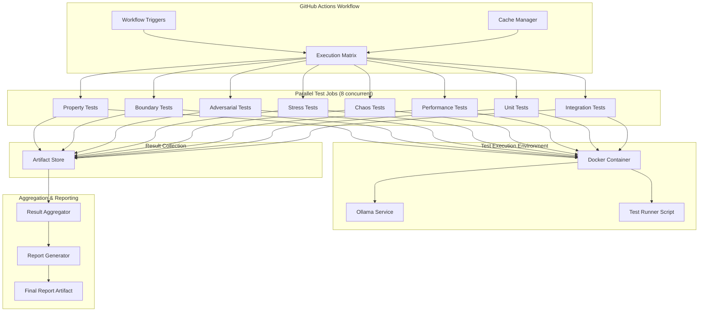

# Technical Design Document: GitHub Fast Test Execution

## Overview

This feature optimizes the GitHub Actions test execution workflow to run all 8 test categories (property, boundary, adversarial, stress, chaos, performance, unit, integration) in parallel with maximum speed while generating production-ready documentation. The system leverages Docker containers, intelligent caching, Ollama LLM service, and parallel matrix execution to minimize total execution time from setup through result aggregation.

The design focuses on three key optimization areas:
1. **Parallel execution**: All 8 test categories run concurrently using GitHub Actions matrix strategy
2. **Intelligent caching**: Dependencies, Docker images, and Hypothesis databases are cached across runs
3. **Fast result aggregation**: Results are collected and consolidated efficiently with production-ready reporting

The system is designed to handle transient failures gracefully, continue execution when individual categories fail, and provide comprehensive visibility into test results through multiple report formats.

## Architecture

### System Components



### Component Responsibilities

**Test Orchestrator (GitHub Actions Workflow)**
- Manages workflow triggers (push, PR, schedule, manual)
- Configures parallel execution matrix with 8 concurrent jobs
- Coordinates cache restoration and invalidation
- Sets environment variables and timeouts
- Handles job-level error recovery with continue-on-error

**Cache Manager (GitHub Actions Cache)**
- Caches pip packages with requirements.txt as cache key
- Caches Docker container images from GitHub Container Registry
- Caches Hypothesis test databases (.hypothesis directory)
- Invalidates caches when dependencies change
- Restores caches before test execution

**Docker Container**
- Pre-built image with all Python dependencies installed
- Uses python:3.11-slim base with uv package manager
- Includes langchain, chromadb, sentence_transformers, pytest
- Runs in network host mode for Ollama connectivity
- Tagged as latest for automatic updates

**Ollama Service**
- Lightweight LLM service for testing LLM-dependent functionality
- Runs in background mode within each test job
- Uses qwen2.5:3b model for fast inference
- Falls back to mock implementations if unavailable
- Listens on http://localhost:11434

**Test Runner Script (.github/scripts/run_tests.sh)**
- Executes pytest for specific test category
- Maps category names to test file paths
- Configures maxfail limits per category
- Generates JSON, HTML, and XML output files
- Handles test discovery and execution errors

**Result Aggregator (Python inline script)**
- Downloads all artifacts from parallel jobs
- Parses JSON result files from each category
- Calculates aggregate metrics (total, passed, failed, errors, skipped)
- Computes pass rates and duration statistics
- Generates category breakdown

**Report Generator (Python inline script)**
- Produces aggregated JSON report with all metrics
- Formats console output with tables and separators
- Validates success criteria (≥95% pass rate)
- Includes execution timestamp and parallel job count
- Uploads final aggregated results as artifact

### Data Flow

1. **Workflow Trigger**: Push, PR, schedule, or manual dispatch triggers workflow
2. **Cache Restoration**: Cache Manager restores pip packages, Docker image, and Hypothesis databases
3. **Matrix Expansion**: Execution Matrix spawns 8 parallel jobs, one per test category
4. **Container Setup**: Each job pulls pre-built Docker container from GHCR
5. **Ollama Startup**: Ollama service starts in background and pulls qwen2.5:3b model
6. **Test Execution**: Test Runner script executes pytest for assigned category
7. **Result Upload**: Each job uploads JSON/HTML/XML results to Artifact Store
8. **Aggregation**: Result Aggregator downloads all artifacts and consolidates results
9. **Reporting**: Report Generator produces final aggregated report and validates success criteria
10. **Artifact Storage**: Final aggregated results uploaded as separate artifact

## Components and Interfaces

### GitHub Actions Workflow Interface

**Workflow File**: `.github/workflows/extreme-tests-simple-parallel.yml`

**Trigger Configuration**:
```yaml
on:
  push:
    branches: [ main, develop ]
  pull_request:
    branches: [ main, develop ]
  schedule:
    - cron: '0 2 * * 0'  # Weekly on Sunday at 2 AM
  workflow_dispatch:
    inputs:
      test_category:
        type: choice
        options: [all, property, boundary, adversarial, stress, chaos, performance, unit, integration]
```

**Matrix Strategy**:
```yaml
strategy:
  fail-fast: false
  max-parallel: 8
  matrix:
    category: [property, boundary, adversarial, stress, chaos, performance, unit, integration]
```

**Job Configuration**:
- Runs on: ubuntu-latest
- Timeout: 120 minutes
- Continue on error: true
- Container: ghcr.io/${{ github.repository }}:latest

### Cache Manager Interface

**Pip Cache**:
- Key: `pip-${{ hashFiles('requirements.txt') }}`
- Path: `~/.cache/pip`
- Restore keys: `pip-`

**Docker Image Cache**:
- Registry: GitHub Container Registry (ghcr.io)
- Authentication: GitHub token
- Image: `ghcr.io/${{ github.repository }}:latest`
- Pull policy: Always (checks for updates)

**Hypothesis Database Cache**:
- Key: `hypothesis-${{ hashFiles('tests/**/*.py') }}`
- Path: `.hypothesis/`
- Restore keys: `hypothesis-`

### Test Runner Script Interface

**Script Path**: `.github/scripts/run_tests.sh`

**Function Signature**:
```bash
run_tests.sh <category> <output_dir>
```

**Parameters**:
- `category`: One of [property, boundary, adversarial, stress, chaos, performance, unit, integration, all]
- `output_dir`: Directory for test output files (default: test_outputs/extreme)

**Output Files**:
- `junit_<category>.xml`: JUnit XML format for CI integration
- `report_<category>.json`: JSON format with detailed test results

**Exit Codes**:
- 0: Tests completed (may have failures)
- 1: Invalid category or script error

**Environment Variables**:
- `PYTHONPATH`: Set to workspace root
- `OLLAMA_HOST`: Set to http://localhost:11434

### Test Category Mapping

| Category | Test Paths | Max Fail |
|----------|-----------|----------|
| property | tests/extreme/engines/test_property_test_expander.py, tests/property/ | 5 |
| boundary | tests/extreme/engines/test_boundary_tester.py | 5 |
| adversarial | tests/extreme/engines/test_adversarial_tester.py | 5 |
| stress | tests/extreme/engines/test_stress_tester.py, tests/extreme/engines/test_component_stress_tester.py | 3 |
| chaos | tests/extreme/engines/test_chaos_engine.py, tests/extreme/engines/test_integration_chaos.py | 3 |
| performance | tests/extreme/engines/test_performance_profiler.py | 3 |
| unit | tests/unit/ | 10 |
| integration | tests/integration/ | 5 |

### Result Aggregator Interface

**Input**: Downloaded artifacts from all parallel jobs
- Location: `all-test-results/test-results-<category>/`
- Format: JSON files with test results

**Output**: Aggregated results JSON
- Location: `aggregated_results.json`
- Format:
```json
{
  "execution_date": "ISO 8601 timestamp",
  "total_tests": 0,
  "passed": 0,
  "failed": 0,
  "errors": 0,
  "skipped": 0,
  "duration_seconds": 0,
  "pass_rate": 0.0,
  "parallel_jobs": 8,
  "categories": {
    "category_name": {
      "total": 0,
      "passed": 0,
      "failed": 0,
      "errors": 0
    }
  }
}
```

### Report Generator Interface

**Console Output Format**:
```
================================================================================
PARALLEL TEST SUITE RESULTS
================================================================================
Parallel Jobs: 8
Total Tests: 150
Passed: 145 (96.7%)
Failed: 3
Errors: 1
Skipped: 1
Duration: 12.5 minutes

Category Breakdown:
  property: 20/20 (100.0%)
  boundary: 18/20 (90.0%)
  adversarial: 19/20 (95.0%)
  stress: 15/15 (100.0%)
  chaos: 14/15 (93.3%)
  performance: 10/10 (100.0%)
  unit: 30/30 (100.0%)
  integration: 19/20 (95.0%)
================================================================================
✅ SUCCESS CRITERIA MET (≥95% pass rate)
================================================================================
```

## Data Models

### Test Result JSON Schema

```json
{
  "total_tests": "integer",
  "passed": "integer",
  "failed": "integer",
  "errors": "integer",
  "skipped": "integer",
  "duration_seconds": "float",
  "tests": [
    {
      "test_id": "string",
      "status": "pass|fail|error|skip",
      "duration": "float",
      "error_message": "string|null"
    }
  ]
}
```

### Aggregated Results Schema

```json
{
  "execution_date": "ISO 8601 string",
  "total_tests": "integer",
  "passed": "integer",
  "failed": "integer",
  "errors": "integer",
  "skipped": "integer",
  "duration_seconds": "float",
  "pass_rate": "float (0-100)",
  "parallel_jobs": "integer",
  "categories": {
    "category_name": {
      "total": "integer",
      "passed": "integer",
      "failed": "integer",
      "errors": "integer"
    }
  }
}
```

## Error Handling

### Job-Level Error Handling

**Continue on Error**: All test category jobs are configured with `continue-on-error: true` to ensure one failing category doesn't block others.

**Timeout Management**: Each job has a 120-minute timeout. If exceeded, the job is terminated and marked as failed, but other jobs continue.

**Artifact Upload Failures**: Artifact upload steps use `if: always()` and `if-no-files-found: ignore` to prevent upload failures from failing the job.

### Test Execution Error Handling

**Ollama Service Failures**: If Ollama fails to start or model pull fails, tests continue using mock LLM implementations. The script logs warnings but doesn't fail.

**Test Discovery Failures**: The run_tests.sh script first attempts test discovery. If discovery fails, it logs the error but continues to attempt execution.

**Pytest Execution Failures**: The script captures pytest exit codes but returns 0 to prevent script failure. Test failures are recorded in result files.

**Max Fail Limits**: Each category has a maxfail limit (3-10 depending on category) to stop execution after multiple failures, saving time.

### Aggregation Error Handling

**Missing Artifacts**: If no test results are found, the aggregator generates an empty results summary with zero tests, indicating minimal dependency mode.

**Malformed JSON**: The aggregator wraps JSON parsing in try-except blocks. If a file is malformed, it logs the error and continues processing other files.

**Missing Categories**: If a category produces no results, it's excluded from the category breakdown but doesn't cause aggregation to fail.

### Resilience Mechanisms

**Fail-Fast Disabled**: The matrix strategy uses `fail-fast: false` to ensure all categories run even if some fail early.

**Aggregation Always Runs**: The aggregate-results job uses `if: always()` to run even when all test jobs fail.

**Graceful Degradation**: The system operates in "minimal dependency mode" when no tests execute, providing informational output rather than failing.

**Error Logging**: All error conditions are logged to console output for debugging, with clear emoji indicators (⚠️, ❌, ℹ️, ✅).

## Testing Strategy

This feature involves infrastructure configuration and CI/CD orchestration rather than application logic with testable properties. The testing approach focuses on integration testing, smoke testing, and validation rather than property-based testing.

### Integration Testing

**Workflow Integration Tests**:
- Test workflow triggers correctly on push, PR, schedule, and manual dispatch
- Verify matrix expansion creates 8 parallel jobs
- Validate cache restoration and invalidation logic
- Confirm artifact upload and download functionality
- Test aggregation job runs after all test jobs complete

**Container Integration Tests**:
- Verify Docker container builds successfully with all dependencies
- Test container authentication to GitHub Container Registry
- Validate network host mode allows Ollama connectivity
- Confirm PYTHONPATH and environment variables are set correctly

**Ollama Integration Tests**:
- Test Ollama service starts in background mode
- Verify model pull succeeds or falls back to mocks
- Validate Ollama readiness check before test execution
- Test LLM-dependent tests can connect to Ollama service

### Smoke Testing

**Workflow Smoke Tests**:
- Trigger workflow manually with each category option
- Verify workflow completes without infrastructure errors
- Confirm all 8 categories execute when "all" is selected
- Validate timeout doesn't trigger prematurely

**Cache Smoke Tests**:
- Verify pip cache is created on first run
- Confirm cache is restored on subsequent runs
- Test cache invalidation when requirements.txt changes
- Validate Hypothesis database cache persists across runs

**Script Smoke Tests**:
- Execute run_tests.sh with each category locally
- Verify script handles invalid category gracefully
- Confirm output files are generated in correct location
- Test script exits with appropriate codes

### Validation Testing

**Result Aggregation Validation**:
- Verify aggregator correctly sums test counts across categories
- Validate pass rate calculation is accurate
- Confirm category breakdown includes all executed categories
- Test aggregator handles missing or empty result files

**Report Generation Validation**:
- Verify console output matches expected format
- Validate success criteria logic (≥95% pass rate)
- Confirm JSON report contains all required fields
- Test report handles zero tests gracefully

**End-to-End Validation**:
- Run complete workflow from trigger to final report
- Verify total execution time is minimized through parallelization
- Confirm all artifacts are uploaded and accessible
- Validate final report accurately reflects test results

### Manual Testing Checklist

- [ ] Trigger workflow on push to main branch
- [ ] Trigger workflow on pull request
- [ ] Trigger workflow manually with specific category
- [ ] Trigger workflow manually with "all" categories
- [ ] Verify cache hit on second run
- [ ] Verify cache miss after requirements.txt change
- [ ] Confirm Ollama service starts successfully
- [ ] Confirm tests fall back to mocks when Ollama fails
- [ ] Verify all 8 categories run in parallel
- [ ] Confirm aggregation runs even when tests fail
- [ ] Validate final report shows correct metrics
- [ ] Verify artifacts are retained for 30 days

### Performance Validation

**Execution Time Targets**:
- Container pull: < 2 minutes (with cache)
- Ollama startup: < 30 seconds
- Test execution per category: < 15 minutes (varies by category)
- Result aggregation: < 1 minute
- Total workflow time: < 20 minutes (with parallelization)

**Cache Effectiveness**:
- Pip cache hit rate: > 90% on unchanged dependencies
- Docker image cache hit rate: > 95% on unchanged Dockerfile
- Hypothesis cache hit rate: > 80% on unchanged test code

## Deployment Considerations

### GitHub Actions Configuration

**Runner Requirements**:
- Ubuntu-latest runners (GitHub-hosted)
- Minimum 2 CPU cores per runner
- Minimum 7 GB RAM per runner
- Docker support enabled

**Concurrency Limits**:
- Free tier: 20 concurrent jobs (sufficient for 8 parallel categories)
- Pro tier: 40 concurrent jobs
- Enterprise: Unlimited

**Artifact Storage**:
- Retention: 30 days (configurable)
- Size limit: 10 GB per artifact (sufficient for test results)
- Total storage: Depends on GitHub plan

### Container Registry Setup

**GitHub Container Registry (GHCR)**:
- Enable GHCR for repository
- Configure package visibility (private recommended)
- Set up GitHub token authentication
- Tag images with latest and commit SHA

**Container Build Process**:
- Build container on Dockerfile changes
- Push to ghcr.io/${{ github.repository }}:latest
- Use multi-stage build for optimization
- Include healthcheck for container validation

### Secret Management

**Required Secrets**:
- `GITHUB_TOKEN`: Automatically provided by GitHub Actions
- No additional secrets required for basic functionality

**Optional Secrets**:
- `OLLAMA_API_KEY`: If using hosted Ollama service
- `SLACK_WEBHOOK`: For notification integration

### Monitoring and Observability

**Workflow Monitoring**:
- GitHub Actions UI shows job status and logs
- Email notifications on workflow failure (configurable)
- Status badges in README for visibility

**Metrics to Track**:
- Workflow execution time trend
- Cache hit rate over time
- Test pass rate by category
- Artifact size growth

**Alerting**:
- Alert on pass rate < 95%
- Alert on workflow timeout
- Alert on cache invalidation frequency spike

### Rollout Strategy

**Phase 1: Validation**
- Deploy to feature branch
- Run workflow multiple times to validate
- Verify cache behavior and timing
- Confirm all categories execute correctly

**Phase 2: Staging**
- Merge to develop branch
- Monitor workflow on develop for 1 week
- Collect performance metrics
- Adjust timeouts and maxfail limits if needed

**Phase 3: Production**
- Merge to main branch
- Enable scheduled runs
- Monitor for 2 weeks
- Document any issues and resolutions

**Rollback Plan**:
- Revert workflow file to previous version
- Clear caches if corruption suspected
- Rebuild Docker container if image issues
- Fall back to sequential execution if parallel issues

