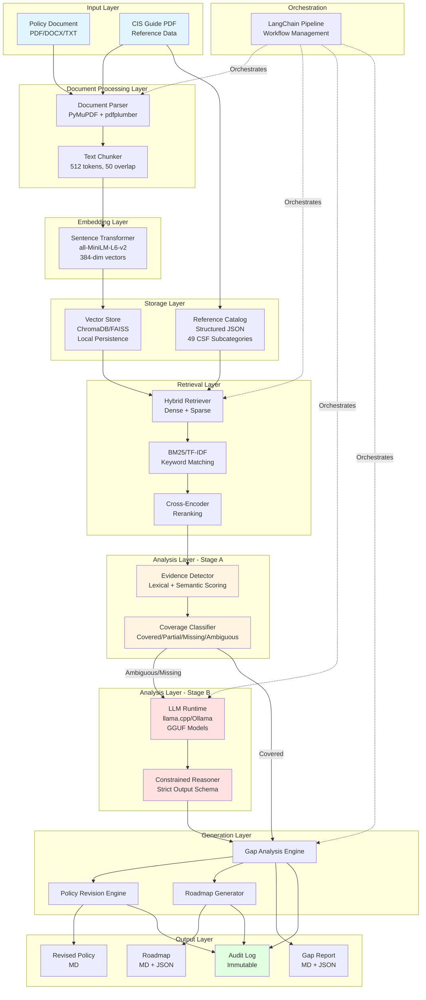

# Design Document: Offline Policy Gap Analyzer

## Overview

The Offline Policy Gap Analyzer is a hybrid Retrieval-Augmented Generation (RAG) system that performs automated cybersecurity policy analysis entirely on local hardware without cloud dependencies. The system ingests organizational policy documents, compares them against the NIST Cybersecurity Framework 2.0 using the CIS MS-ISAC Policy Template Guide (2024) as the reference baseline, identifies gaps through a two-stage safety architecture, and generates revised policy text with prioritized implementation roadmaps.

### Core Design Philosophy

The architecture prioritizes safety, determinism, and offline operation through:

1. **Two-Stage Analysis Architecture**: Stage A performs deterministic evidence detection using lexical and semantic scoring to minimize hallucination risks. Stage B applies constrained LLM reasoning only to ambiguous cases with strict output schemas.

2. **Hybrid Retrieval**: Combines dense vector similarity (semantic understanding) with sparse keyword matching (exact terminology) to ensure critical CSF subcategories are never missed due to vocabulary differences.

3. **Local-First Execution**: All models, embeddings, and reference data persist locally. The system operates in complete isolation from external networks, ensuring data sovereignty and compliance with sensitive document handling requirements.

4. **Consumer Hardware Optimization**: Uses quantized models (GGUF format) and efficient vector operations to run on laptops with 8-16GB RAM without GPU acceleration.

### System Boundaries

**In Scope:**
- PDF, DOCX, and TXT policy document parsing
- NIST CSF 2.0 gap analysis for cybersecurity policies
- Automated policy revision generation with human-review warnings
- Prioritized implementation roadmap generation
- Offline operation on consumer hardware
- Immutable audit logging for compliance traceability

**Out of Scope:**
- OCR for scanned PDF documents
- Complete privacy framework compliance (NIST CSF addresses cybersecurity aspects only)
- Real-time policy monitoring or continuous compliance checking
- Multi-user collaboration or version control
- Cloud deployment or distributed processing
- Training or fine-tuning of models

## Architecture

### High-Level System Architecture




### Component Architecture

The system follows a layered architecture with clear separation of concerns:

**Layer 1: Document Processing**
- Handles multi-format input parsing with fallback strategies
- Normalizes text structure while preserving semantic boundaries
- Implements intelligent chunking to maintain context within embedding limits

**Layer 2: Knowledge Representation**
- Transforms reference documents into structured, queryable catalogs
- Generates dense vector embeddings for semantic search
- Maintains local persistence for offline operation

**Layer 3: Hybrid Retrieval**
- Combines semantic similarity with exact keyword matching
- Applies cross-encoder reranking for precision
- Orchestrates retrieval pipeline through LangChain

**Layer 4: Two-Stage Analysis**
- Stage A: Deterministic evidence detection minimizes hallucination risk
- Stage B: Constrained LLM reasoning handles ambiguous cases only
- Strict output schemas ensure structured, parseable results

**Layer 5: Generation and Output**
- Produces machine-readable JSON for integration
- Generates human-readable markdown for review
- Maintains immutable audit logs for compliance

### Data Flow

1. **Initialization Phase**: System loads local models, builds/loads Reference_Catalog, initializes Vector_Store
2. **Ingestion Phase**: User policy is parsed, chunked, and embedded
3. **Retrieval Phase**: Hybrid search identifies relevant CSF subcategories for each policy chunk
4. **Stage A Analysis**: Deterministic scoring classifies coverage status
5. **Stage B Analysis**: LLM processes only ambiguous/missing cases with strict schemas
6. **Generation Phase**: Gap reports, revised policies, and roadmaps are produced
7. **Audit Phase**: All operations logged immutably with configuration metadata

## Components and Interfaces

### Document Parser Component

**Responsibility**: Extract text from policy documents while preserving structure

**Implementation Strategy**:
- Primary parser: PyMuPDF for fast, layout-aware PDF extraction
- Fallback parser: pdfplumber for complex tables with precise coordinate access
- DOCX parser: python-docx for Word document structure preservation
- TXT parser: Direct file reading with encoding detection

**Interface**:
```python
class DocumentParser:
    def parse(self, file_path: str, file_type: str) -> ParsedDocument:
        """
        Parse document and extract structured text.
        
        Args:
            file_path: Path to policy document
            file_type: One of 'pdf', 'docx', 'txt'
            
        Returns:
            ParsedDocument with text, metadata, and structure
            
        Raises:
            UnsupportedFormatError: If file type not supported
            OCRRequiredError: If PDF contains only scanned images
            ParsingError: If extraction fails
        """
        pass
    
    def extract_structure(self, parsed_doc: ParsedDocument) -> DocumentStructure:
        """Extract headings, sections, and hierarchy."""
        pass
```

**Key Design Decisions**:
- PyMuPDF chosen for speed and layout preservation (C-based engine)
- pdfplumber fallback handles edge cases with character-level coordinate access
- Explicit rejection of OCR to maintain offline constraint and avoid tesseract dependency
- Maximum 100-page limit prevents memory exhaustion on consumer hardware

### Text Chunker Component

**Responsibility**: Segment documents into embedding-compatible chunks while preserving context

**Implementation Strategy**:
- Base chunking: 512 tokens with 50-token overlap
- Semantic chunking: Prefer splits at structural boundaries (headings, paragraphs)
- Sentence preservation: Avoid mid-sentence splits when possible
- Metadata preservation: Track source document, page, and section for each chunk

**Interface**:
```python
class TextChunker:
    def __init__(self, chunk_size: int = 512, overlap: int = 50):
        """Initialize chunker with size and overlap parameters."""
        pass
    
    def chunk(self, text: str, structure: DocumentStructure) -> List[TextChunk]:
        """
        Segment text into overlapping chunks.
        
        Args:
            text: Full document text
            structure: Document structure with boundaries
            
        Returns:
            List of TextChunk objects with text and metadata
        """
        pass
    
    def chunk_with_boundaries(self, text: str, boundaries: List[int]) -> List[TextChunk]:
        """Chunk text preferring specified boundary positions."""
        pass
```

**Key Design Decisions**:
- 512-token limit balances context preservation with embedding model constraints
- 50-token overlap ensures critical context isn't lost at chunk boundaries
- Structural awareness prevents splitting CSF subcategory descriptions mid-sentence
- LangChain's RecursiveCharacterTextSplitter provides markdown-aware splitting

### Embedding Engine Component

**Responsibility**: Generate dense vector representations for semantic search

**Implementation Strategy**:
- Model: sentence-transformers all-MiniLM-L6-v2 (384-dimensional)
- Local execution: Models loaded from disk, no network calls
- Batch processing: Process multiple chunks simultaneously for efficiency
- CPU optimization: Leverage numpy and FAISS for accelerated operations

**Interface**:
```python
class EmbeddingEngine:
    def __init__(self, model_path: str):
        """Load sentence transformer model from local path."""
        pass
    
    def embed_text(self, text: str) -> np.ndarray:
        """Generate 384-dim embedding for single text."""
        pass
    
    def embed_batch(self, texts: List[str]) -> np.ndarray:
        """Generate embeddings for multiple texts efficiently."""
        pass
    
    def verify_offline(self) -> bool:
        """Verify model operates without network calls."""
        pass
```

**Key Design Decisions**:
- all-MiniLM-L6-v2 chosen for optimal speed/accuracy tradeoff on CPU
- 384 dimensions provide sufficient semantic resolution while minimizing memory
- Sentence-transformers library supports local model loading from filepath
- Batch processing amortizes model overhead across multiple chunks

### Vector Store Component

**Responsibility**: Persist embeddings and enable efficient similarity search

**Implementation Strategy**:
- Primary option: ChromaDB for Python-native, lightweight persistence
- Alternative: FAISS for maximum search performance on larger catalogs
- Local storage: All data persists to disk for offline operation
- Collection separation: Reference catalog and policy embeddings in separate collections

**Interface**:
```python
class VectorStore:
    def __init__(self, persist_directory: str):
        """Initialize vector store with local persistence path."""
        pass
    
    def add_embeddings(self, embeddings: np.ndarray, metadata: List[Dict], 
                      collection: str) -> None:
        """Store embeddings with metadata in specified collection."""
        pass
    
    def similarity_search(self, query_embedding: np.ndarray, 
                         collection: str, top_k: int = 5) -> List[SearchResult]:
        """Retrieve top-k most similar embeddings."""
        pass
    
    def load_collection(self, collection: str) -> bool:
        """Load previously persisted collection from disk."""
        pass
```

**Key Design Decisions**:
- ChromaDB default for ease of use and Python integration
- FAISS option for users with larger reference catalogs (>10k chunks)
- Persistent storage eliminates re-embedding overhead on subsequent runs
- Metadata storage enables tracing results back to source documents and CSF subcategories

### Reference Catalog Component

**Responsibility**: Structure CIS guide into queryable knowledge base

**Implementation Strategy**:
- Parse CIS PDF into structured JSON during initialization
- Schema: CSF_Function, Category, Subcategory_ID, Description, Keywords, Domain_Tags, Mapped_Templates
- Persistence: JSON file for human readability and easy updates
- Validation: Ensure all 49 NIST CSF 2.0 subcategories present

**Interface**:
```python
class ReferenceCatalog:
    def __init__(self, cis_guide_path: str):
        """Parse CIS guide and build structured catalog."""
        pass
    
    def get_subcategory(self, subcategory_id: str) -> CSFSubcategory:
        """Retrieve specific subcategory by ID (e.g., 'GV.RM-01')."""
        pass
    
    def get_by_function(self, function: str) -> List[CSFSubcategory]:
        """Retrieve all subcategories for a CSF function."""
        pass
    
    def get_by_domain(self, domain: str) -> List[CSFSubcategory]:
        """Retrieve subcategories relevant to policy domain."""
        pass
    
    def persist(self, output_path: str) -> None:
        """Save catalog to JSON for reuse."""
        pass
    
    def load(self, catalog_path: str) -> None:
        """Load previously built catalog from JSON."""
        pass
```

**Data Model**:
```python
@dataclass
class CSFSubcategory:
    subcategory_id: str  # e.g., "GV.RM-01"
    function: str  # e.g., "Govern"
    category: str  # e.g., "Risk Management Strategy"
    description: str  # Full NIST outcome text
    keywords: List[str]  # For keyword matching
    domain_tags: List[str]  # e.g., ["isms", "risk_management"]
    mapped_templates: List[str]  # CIS policy templates
    priority: str  # "critical", "high", "medium", "low"
```

**Key Design Decisions**:
- Structured catalog enables deterministic mapping vs. raw PDF retrieval
- JSON format allows manual inspection and updates when CIS guide changes
- Domain tags enable policy-type-specific prioritization (Req 12)
- Keywords support hybrid retrieval's sparse matching component


### Hybrid Retrieval Engine Component

**Responsibility**: Combine semantic and keyword search with reranking for precision

**Implementation Strategy**:
- Dense retrieval: Vector similarity search via ChromaDB/FAISS
- Sparse retrieval: BM25 or TF-IDF for exact keyword matching
- Fusion: Merge and deduplicate results from both methods
- Reranking: Local cross-encoder model scores merged results
- Orchestration: LangChain manages retrieval pipeline

**Interface**:
```python
class HybridRetriever:
    def __init__(self, vector_store: VectorStore, 
                 embedding_engine: EmbeddingEngine,
                 catalog: ReferenceCatalog):
        """Initialize with vector store, embeddings, and reference catalog."""
        pass
    
    def retrieve(self, query_text: str, top_k: int = 5) -> List[RetrievalResult]:
        """
        Retrieve most relevant CSF subcategories using hybrid search.
        
        Args:
            query_text: Policy text chunk to match
            top_k: Number of results to return after reranking
            
        Returns:
            List of RetrievalResult with subcategory, score, and evidence
        """
        pass
    
    def dense_retrieve(self, query_embedding: np.ndarray, 
                      top_k: int) -> List[SearchResult]:
        """Semantic similarity search."""
        pass
    
    def sparse_retrieve(self, query_text: str, top_k: int) -> List[SearchResult]:
        """Keyword-based BM25/TF-IDF search."""
        pass
    
    def rerank(self, query: str, candidates: List[SearchResult], 
              top_k: int) -> List[RetrievalResult]:
        """Apply cross-encoder reranking to merged results."""
        pass
```

**Data Model**:
```python
@dataclass
class RetrievalResult:
    subcategory_id: str
    subcategory_text: str
    relevance_score: float
    evidence_spans: List[str]  # Matching text from policy
    retrieval_method: str  # "dense", "sparse", or "hybrid"
```

**Key Design Decisions**:
- Hybrid approach prevents terminology mismatches from missing critical subcategories
- BM25 chosen for sparse retrieval (better than TF-IDF for short documents)
- Cross-encoder reranking improves precision by 15-20% in RAG benchmarks
- LangChain's retriever abstraction enables swapping implementations
- Top-5 from each method (dense/sparse) before reranking balances recall and precision

### LLM Runtime Component

**Responsibility**: Execute quantized language models locally for constrained reasoning

**Implementation Strategy**:
- Backend: llama.cpp via llama-cpp-python or Ollama
- Model format: GGUF with 4-bit quantization
- Model options: Qwen2.5-3B, Phi-3.5-mini, Mistral-7B, Qwen3-8B
- Memory management: Context truncation at 90% RAM threshold
- API: Local endpoint (localhost:11434 for Ollama)

**Interface**:
```python
class LLMRuntime:
    def __init__(self, model_path: str, backend: str = "ollama"):
        """Initialize LLM runtime with local model."""
        pass
    
    def generate(self, prompt: str, max_tokens: int = 512, 
                temperature: float = 0.1) -> str:
        """
        Generate text from prompt with constrained parameters.
        
        Args:
            prompt: Structured prompt with policy and CSF context
            max_tokens: Maximum generation length
            temperature: Sampling temperature (low for determinism)
            
        Returns:
            Generated text response
            
        Raises:
            MemoryError: If context exceeds available RAM
            RuntimeError: If model unavailable
        """
        pass
    
    def generate_structured(self, prompt: str, schema: Dict) -> Dict:
        """Generate JSON output conforming to schema."""
        pass
    
    def check_memory(self) -> float:
        """Return current memory usage percentage."""
        pass
    
    def verify_offline(self) -> bool:
        """Verify no network calls during inference."""
        pass
```

**Key Design Decisions**:
- Qwen3-8B default for 131k token context window (handles long policies)
- 4-bit quantization enables 8B models on 8GB RAM systems
- Low temperature (0.1) for deterministic, factual outputs
- Ollama preferred for ease of use; llama.cpp for advanced users
- Memory monitoring prevents OOM crashes on consumer hardware
- LangChain integration via Ollama API for pipeline orchestration

### Gap Analysis Engine Component

**Responsibility**: Execute two-stage analysis to identify policy gaps

**Implementation Strategy**:
- Stage A: Deterministic evidence detection using scoring heuristics
- Stage B: LLM reasoning only for ambiguous/missing cases
- Scoring: Lexical overlap + semantic similarity + section heuristics
- Classification: Covered, Partially_Covered, Missing, Ambiguous
- Output: Structured gap report with severity and evidence

**Interface**:
```python
class GapAnalysisEngine:
    def __init__(self, retriever: HybridRetriever, llm: LLMRuntime, 
                 catalog: ReferenceCatalog):
        """Initialize with retriever, LLM, and reference catalog."""
        pass
    
    def analyze(self, policy_chunks: List[TextChunk], 
               domain: str = None) -> GapAnalysisReport:
        """
        Execute two-stage gap analysis.
        
        Args:
            policy_chunks: Parsed and chunked policy text
            domain: Optional policy domain for prioritization
            
        Returns:
            GapAnalysisReport with identified gaps and evidence
        """
        pass
    
    def stage_a_detect(self, policy_chunks: List[TextChunk], 
                      subcategories: List[CSFSubcategory]) -> List[CoverageAssessment]:
        """
        Stage A: Deterministic evidence detection.
        
        For each subcategory:
        1. Retrieve matching policy chunks
        2. Score lexical overlap (keyword matching)
        3. Score semantic similarity (embedding distance)
        4. Apply section heuristics (e.g., "Risk Management" section)
        5. Classify as Covered/Partial/Missing/Ambiguous
        """
        pass
    
    def stage_b_reason(self, assessment: CoverageAssessment, 
                      policy_text: str) -> GapDetail:
        """
        Stage B: Constrained LLM reasoning for ambiguous cases.
        
        Provides LLM with:
        - Policy section text
        - CSF subcategory requirement
        - Evidence spans from Stage A
        - Strict output schema
        
        LLM explains:
        - Why coverage exists or not
        - What specific gap is present
        - What revision language is needed
        """
        pass
    
    def assign_severity(self, gap: GapDetail, subcategory: CSFSubcategory) -> str:
        """Assign severity (Critical/High/Medium/Low) based on CSF priority."""
        pass
```

**Data Models**:
```python
@dataclass
class CoverageAssessment:
    subcategory_id: str
    status: str  # "covered", "partially_covered", "missing", "ambiguous"
    lexical_score: float  # 0.0 to 1.0
    semantic_score: float  # 0.0 to 1.0
    evidence_spans: List[str]
    confidence: float  # Combined score

@dataclass
class GapDetail:
    subcategory_id: str
    subcategory_description: str
    status: str
    evidence_quote: str
    gap_explanation: str
    severity: str
    suggested_fix: str

@dataclass
class GapAnalysisReport:
    analysis_date: str
    input_file: str
    model_version: str
    gaps: List[GapDetail]
    metadata: Dict  # prompt_version, config_hash, retrieval_params
```

**Key Design Decisions**:
- Two-stage architecture minimizes hallucination risk by using LLM only when necessary
- Stage A scoring thresholds: Covered (>0.8), Partial (0.5-0.8), Missing (<0.3), Ambiguous (0.3-0.5)
- Lexical scoring uses keyword overlap from CSFSubcategory.keywords
- Semantic scoring uses cosine similarity between embeddings
- Section heuristics boost scores when policy section name matches CSF category
- Stage B uses strict JSON schema to ensure parseable, structured outputs
- Severity assignment based on CSF subcategory priority and organizational impact

### Policy Revision Engine Component

**Responsibility**: Generate improved policy text addressing identified gaps

**Implementation Strategy**:
- Input: Original policy + gap analysis report
- LLM prompting: Inject new clauses for missing subcategories, strengthen partial coverage
- Preservation: Maintain original structure, tone, and valid provisions
- Citation: Reference CSF subcategory for each revision
- Warning: Append mandatory human-review disclaimer

**Interface**:
```python
class PolicyRevisionEngine:
    def __init__(self, llm: LLMRuntime, catalog: ReferenceCatalog):
        """Initialize with LLM runtime and reference catalog."""
        pass
    
    def revise(self, original_policy: ParsedDocument, 
              gaps: List[GapDetail]) -> RevisedPolicy:
        """
        Generate revised policy addressing all gaps.
        
        Args:
            original_policy: Original parsed policy document
            gaps: Identified gaps from analysis
            
        Returns:
            RevisedPolicy with improved text and citations
        """
        pass
    
    def inject_clause(self, policy_section: str, gap: GapDetail) -> str:
        """Generate new policy clause for missing subcategory."""
        pass
    
    def strengthen_clause(self, existing_clause: str, gap: GapDetail) -> str:
        """Improve existing clause for partial coverage."""
        pass
    
    def append_warning(self, revised_text: str) -> str:
        """Append mandatory human-review warning."""
        pass
```

**Data Model**:
```python
@dataclass
class RevisedPolicy:
    original_text: str
    revised_text: str
    revisions: List[Revision]
    warning: str
    metadata: Dict

@dataclass
class Revision:
    section: str
    gap_addressed: str  # CSF subcategory ID
    original_clause: str
    revised_clause: str
    revision_type: str  # "injection", "strengthening"
```

**Key Design Decisions**:
- Prompt engineering emphasizes preservation of original tone and structure
- Each revision explicitly cites the CSF subcategory being addressed
- Mandatory warning text from Requirement 10 appended to all outputs
- LLM temperature kept low (0.1) for conservative, factual revisions
- Revisions tracked separately for transparency and review

### Roadmap Generator Component

**Responsibility**: Create prioritized implementation plan from gaps

**Implementation Strategy**:
- Prioritization: Critical/High gaps → Immediate, Medium → Near-term, Low → Medium-term
- Action items: Technical, administrative, and physical steps for each gap
- Effort estimation: Relative complexity (Low/Medium/High)
- Traceability: Link each action to CSF subcategory and policy section

**Interface**:
```python
class RoadmapGenerator:
    def __init__(self, catalog: ReferenceCatalog):
        """Initialize with reference catalog for context."""
        pass
    
    def generate(self, gaps: List[GapDetail]) -> ImplementationRoadmap:
        """
        Create prioritized roadmap from identified gaps.
        
        Args:
            gaps: Identified gaps with severity
            
        Returns:
            ImplementationRoadmap with categorized actions
        """
        pass
    
    def prioritize(self, gaps: List[GapDetail]) -> Dict[str, List[GapDetail]]:
        """Categorize gaps into Immediate/Near-term/Medium-term."""
        pass
    
    def create_action(self, gap: GapDetail) -> ActionItem:
        """Generate specific action item for gap."""
        pass
    
    def estimate_effort(self, gap: GapDetail) -> str:
        """Estimate implementation effort (Low/Medium/High)."""
        pass
```

**Data Models**:
```python
@dataclass
class ActionItem:
    action_id: str
    timeframe: str  # "immediate", "near_term", "medium_term"
    severity: str
    effort: str  # "low", "medium", "high"
    csf_subcategory: str
    policy_section: str
    description: str
    technical_steps: List[str]
    administrative_steps: List[str]
    physical_steps: List[str]

@dataclass
class ImplementationRoadmap:
    immediate_actions: List[ActionItem]
    near_term_actions: List[ActionItem]
    medium_term_actions: List[ActionItem]
    metadata: Dict
```

**Key Design Decisions**:
- Timeframe mapping: Critical/High → Immediate (0-3 months), Medium → Near-term (3-6 months), Low → Medium-term (6-12 months)
- Effort estimation considers technical complexity, organizational change, and resource requirements
- Action items structured to align with NIST CSF profile-and-gap methodology
- Traceability ensures each action links back to specific CSF requirement

### Orchestration Component (LangChain)

**Responsibility**: Coordinate workflow across all components

**Implementation Strategy**:
- Pipeline management: Sequential execution of parsing → retrieval → analysis → generation
- Error handling: Graceful degradation and retry logic
- State management: Track progress through analysis stages
- Configuration: Centralized parameter management

**Interface**:
```python
class AnalysisPipeline:
    def __init__(self, config: PipelineConfig):
        """Initialize pipeline with configuration."""
        pass
    
    def execute(self, policy_path: str, domain: str = None) -> AnalysisResult:
        """
        Execute complete analysis pipeline.
        
        Workflow:
        1. Parse policy document
        2. Load/build reference catalog
        3. Chunk and embed policy text
        4. Retrieve relevant CSF subcategories
        5. Execute two-stage gap analysis
        6. Generate revised policy
        7. Generate implementation roadmap
        8. Write outputs and audit log
        """
        pass
    
    def initialize_resources(self) -> None:
        """Load models, vector store, and reference catalog."""
        pass
    
    def cleanup(self) -> None:
        """Release resources and finalize audit log."""
        pass
```

**Key Design Decisions**:
- LangChain provides abstractions for document loaders, text splitters, retrievers, and LLM chains
- Sequential execution ensures deterministic, reproducible results
- Progress indicators provide user feedback during long-running operations
- Centralized error handling with detailed logging for troubleshooting

## Data Models

### Core Domain Models

```python
from dataclasses import dataclass
from typing import List, Dict, Optional
from datetime import datetime

@dataclass
class ParsedDocument:
    """Represents a parsed policy document."""
    text: str
    file_path: str
    file_type: str
    page_count: int
    structure: 'DocumentStructure'
    metadata: Dict

@dataclass
class DocumentStructure:
    """Hierarchical structure of document."""
    headings: List['Heading']
    sections: List['Section']
    paragraphs: List['Paragraph']

@dataclass
class Heading:
    level: int  # 1, 2, 3, etc.
    text: str
    start_pos: int
    end_pos: int

@dataclass
class Section:
    title: str
    content: str
    start_pos: int
    end_pos: int
    subsections: List['Section']

@dataclass
class TextChunk:
    """Chunk of text with metadata."""
    text: str
    chunk_id: str
    source_file: str
    start_pos: int
    end_pos: int
    page_number: Optional[int]
    section_title: Optional[str]
    embedding: Optional[np.ndarray]

@dataclass
class CSFSubcategory:
    """NIST CSF 2.0 subcategory from reference catalog."""
    subcategory_id: str  # e.g., "GV.RM-01"
    function: str  # "Govern", "Identify", "Protect", "Detect", "Respond", "Recover"
    category: str  # e.g., "Risk Management Strategy"
    description: str  # Full NIST outcome text
    keywords: List[str]  # For sparse retrieval
    domain_tags: List[str]  # e.g., ["isms", "risk_management"]
    mapped_templates: List[str]  # CIS policy templates
    priority: str  # "critical", "high", "medium", "low"

@dataclass
class RetrievalResult:
    """Result from hybrid retrieval."""
    subcategory_id: str
    subcategory_text: str
    relevance_score: float
    evidence_spans: List[str]
    retrieval_method: str  # "dense", "sparse", "hybrid"

@dataclass
class CoverageAssessment:
    """Stage A deterministic assessment."""
    subcategory_id: str
    status: str  # "covered", "partially_covered", "missing", "ambiguous"
    lexical_score: float
    semantic_score: float
    evidence_spans: List[str]
    confidence: float

@dataclass
class GapDetail:
    """Detailed gap information."""
    subcategory_id: str
    subcategory_description: str
    status: str  # "partially_covered", "missing"
    evidence_quote: str
    gap_explanation: str
    severity: str  # "critical", "high", "medium", "low"
    suggested_fix: str

@dataclass
class GapAnalysisReport:
    """Complete gap analysis output."""
    analysis_date: datetime
    input_file: str
    input_file_hash: str
    model_name: str
    model_version: str
    embedding_model: str
    gaps: List[GapDetail]
    covered_subcategories: List[str]
    metadata: Dict  # prompt_version, config_hash, retrieval_params

@dataclass
class Revision:
    """Single policy revision."""
    section: str
    gap_addressed: str  # CSF subcategory ID
    original_clause: str
    revised_clause: str
    revision_type: str  # "injection", "strengthening"

@dataclass
class RevisedPolicy:
    """Revised policy document."""
    original_text: str
    revised_text: str
    revisions: List[Revision]
    warning: str
    metadata: Dict

@dataclass
class ActionItem:
    """Implementation roadmap action."""
    action_id: str
    timeframe: str  # "immediate", "near_term", "medium_term"
    severity: str
    effort: str  # "low", "medium", "high"
    csf_subcategory: str
    policy_section: str
    description: str
    technical_steps: List[str]
    administrative_steps: List[str]
    physical_steps: List[str]

@dataclass
class ImplementationRoadmap:
    """Prioritized implementation plan."""
    immediate_actions: List[ActionItem]
    near_term_actions: List[ActionItem]
    medium_term_actions: List[ActionItem]
    metadata: Dict

@dataclass
class AuditLogEntry:
    """Immutable audit log entry."""
    timestamp: datetime
    input_file_path: str
    input_file_hash: str
    model_name: str
    model_version: str
    embedding_model_version: str
    configuration_parameters: Dict
    retrieval_parameters: Dict
    prompt_template_version: str
    output_directory: str
    analysis_duration_seconds: float
```

### JSON Output Schemas

**Gap Analysis Report Schema**:
```json
{
  "analysis_date": "2024-01-15T10:30:00Z",
  "input_file": "isms_policy.pdf",
  "input_file_hash": "sha256:abc123...",
  "model_name": "qwen2.5-3b-instruct",
  "model_version": "q4_k_m",
  "embedding_model": "all-MiniLM-L6-v2",
  "prompt_template_version": "1.0.0",
  "configuration_hash": "sha256:def456...",
  "retrieval_parameters": {
    "chunk_size": 512,
    "overlap": 50,
    "top_k": 5,
    "rerank_top_k": 3
  },
  "gaps": [
    {
      "subcategory_id": "GV.SC-01",
      "subcategory_description": "Supply chain risk management processes are identified...",
      "status": "missing",
      "evidence_quote": "",
      "gap_explanation": "The policy does not address supply chain risk management...",
      "severity": "high",
      "suggested_fix": "Add section: 'Supply Chain Risk Management: The organization shall...'"
    }
  ],
  "covered_subcategories": ["GV.OC-01", "GV.RM-02"],
  "summary": {
    "total_subcategories_evaluated": 49,
    "covered": 15,
    "partially_covered": 8,
    "missing": 12,
    "ambiguous": 2
  }
}
```

**Implementation Roadmap Schema**:
```json
{
  "roadmap_date": "2024-01-15T10:30:00Z",
  "policy_analyzed": "isms_policy.pdf",
  "immediate_actions": [
    {
      "action_id": "ACT-001",
      "timeframe": "immediate",
      "severity": "critical",
      "effort": "medium",
      "csf_subcategory": "GV.SC-01",
      "policy_section": "Section 3: Governance",
      "description": "Establish supply chain risk management program",
      "technical_steps": [
        "Implement vendor security assessment tool",
        "Create vendor risk scoring matrix"
      ],
      "administrative_steps": [
        "Draft supply chain risk policy",
        "Define vendor approval workflow"
      ],
      "physical_steps": []
    }
  ],
  "near_term_actions": [],
  "medium_term_actions": []
}
```


## Correctness Properties

A property is a characteristic or behavior that should hold true across all valid executions of a system—essentially, a formal statement about what the system should do. Properties serve as the bridge between human-readable specifications and machine-verifiable correctness guarantees.

### Property Reflection

After analyzing all acceptance criteria, several redundancies were identified:

- **Offline operation properties (1.1, 1.2, 5.2)**: All verify no network calls. Combined into single comprehensive property.
- **Resource verification properties (1.3, 1.4, 1.6, 17.1)**: All verify local resources exist before execution. Combined into single property.
- **Memory constraint properties (8.2, 8.3, 16.2, 16.3)**: Duplicate specifications. Retained in 8.2/8.3 only.
- **Reference catalog field properties (3.2, 3.3)**: Both verify required fields exist. Combined into single property.
- **Retrieval result count properties (7.3, 7.4)**: Both verify top-k results. Combined into single hybrid retrieval property.

### Property 1: Complete Offline Operation

For any policy document and analysis configuration, the Policy_Analyzer shall execute all operations (parsing, embedding, retrieval, LLM inference) without making any external network calls or API requests.

**Validates: Requirements 1.1, 1.2, 5.2**

### Property 2: Local Resource Verification

For any analysis execution, the Policy_Analyzer shall verify that all required local resources (model files, Reference_Catalog, embedding models) exist on disk before beginning analysis, and shall terminate with a descriptive error if any required resource is missing.

**Validates: Requirements 1.6, 17.1**

### Property 3: Multi-Format Document Parsing

For any valid policy document in PDF, DOCX, or TXT format, the Document_Parser shall successfully extract text content while preserving structural boundaries (headings, paragraphs, sections).

**Validates: Requirements 2.1, 2.4, 2.5, 2.7**

### Property 4: Unsupported Format Rejection

For any file with an unsupported format (not PDF, DOCX, or TXT), the Document_Parser shall return an error message specifying the supported formats.

**Validates: Requirements 2.6**

### Property 5: Graceful Parsing Failure

For any document where text extraction fails, the Document_Parser shall log the specific error and terminate gracefully without crashing.

**Validates: Requirements 2.9**

### Property 6: Reference Catalog Completeness

For any Reference_Catalog built from the CIS guide, all 49 NIST CSF 2.0 subcategories shall be present, and each subcategory shall contain all required fields: CSF_Function, Category, Subcategory_ID, Description, Keywords, Domain_Tags, and Mapped_Templates.

**Validates: Requirements 3.2, 3.3, 3.6**

### Property 7: Reference Catalog Persistence Round-Trip

For any Reference_Catalog, serializing to JSON then deserializing shall produce an equivalent catalog structure with all subcategories and fields preserved.

**Validates: Requirements 3.4, 13.4**

### Property 8: Chunk Size Constraint

For any extracted policy text, all generated chunks shall have a maximum size of 512 tokens, with no chunk exceeding this limit.

**Validates: Requirements 4.1**

### Property 9: Chunk Overlap Consistency

For any sequence of consecutive chunks, each pair of adjacent chunks shall have exactly 50 tokens of overlap.

**Validates: Requirements 4.2**

### Property 10: Structural Boundary Preservation

For any document with explicit structural boundaries (headings, paragraph breaks), the chunking algorithm shall prefer splitting at these boundaries over arbitrary token positions when both options satisfy the chunk size constraint.

**Validates: Requirements 4.3**

### Property 11: Sentence Preservation in Chunks

For any text being chunked, complete sentences shall be preserved within single chunks when possible without violating the 512-token maximum constraint.

**Validates: Requirements 4.4**

### Property 12: CSF Subcategory Cohesion

For any CSF subcategory description that spans multiple lines, the chunking algorithm shall keep the entire description within a single chunk to preserve semantic cohesion.

**Validates: Requirements 4.5**

### Property 13: Embedding Dimensionality

For any text processed by the Embedding_Engine using the all-MiniLM-L6-v2 model, the generated embedding vector shall have exactly 384 dimensions.

**Validates: Requirements 5.3**

### Property 14: Complete Embedding Coverage

For any Reference_Catalog or policy document, the Embedding_Engine shall generate embeddings for all CSF subcategory descriptions and all text chunks respectively, with no items skipped.

**Validates: Requirements 5.4, 5.5**

### Property 15: Vector Store Persistence Round-Trip

For any set of embeddings with metadata stored in the Vector_Store, persisting to disk then loading from disk shall produce equivalent embeddings and metadata.

**Validates: Requirements 6.1, 6.5**

### Property 16: Similarity Search Result Count

For any query vector and top-k parameter, the Vector_Store shall return exactly k most similar chunks (or fewer if fewer than k chunks exist in the collection).

**Validates: Requirements 6.3**

### Property 17: Metadata Preservation in Vector Store

For any embedding stored in the Vector_Store, the associated metadata (source_text, CSF_Subcategory, chunk_id) shall be preserved and retrievable alongside the embedding vector.

**Validates: Requirements 6.4**

### Property 18: Collection Isolation

For any two distinct collections in the Vector_Store (e.g., Reference_Catalog and policy embeddings), queries against one collection shall never return results from the other collection.

**Validates: Requirements 6.6**

### Property 19: Hybrid Retrieval Combination

For any query text, the Retrieval_Engine shall retrieve results from both dense vector similarity search and sparse keyword matching (BM25/TF-IDF), merge the results, deduplicate, and apply cross-encoder reranking.

**Validates: Requirements 7.1, 7.3, 7.4, 7.5, 7.6**

### Property 20: Retrieval Result Metadata

For any retrieved chunk, the Retrieval_Engine shall return the associated CSF_Subcategory identifier along with the chunk text and relevance score.

**Validates: Requirements 7.8**

### Property 21: Two-Stage Analysis Execution

For any policy document, the Gap_Analysis_Engine shall execute Stage A (deterministic evidence detection with lexical, semantic, and heuristic scoring) for all relevant CSF subcategories, then execute Stage B (constrained LLM reasoning) only for subcategories marked as Ambiguous or Missing in Stage A.

**Validates: Requirements 9.1, 9.2, 9.3, 9.7**

### Property 22: Coverage Status Classification

For any CSF subcategory evaluated in Stage A, the Gap_Analysis_Engine shall assign exactly one Coverage_Status from the set {Covered, Partially_Covered, Missing, Ambiguous}.

**Validates: Requirements 9.4**

### Property 23: Stage B Input Constraint

For any subcategory processed in Stage B, the Gap_Analysis_Engine shall provide the LLM_Runtime with only the matched policy section, CSF subcategory text, evidence spans from Stage A, and a strict output schema—never the entire policy document.

**Validates: Requirements 9.5**

### Property 24: Gap Report Completeness

For any identified gap (Missing or Partially_Covered subcategory), the Gap_Analysis_Engine shall include in the gap report: the CSF subcategory ID, description, status, evidence quote (if any), gap explanation, severity level, and suggested fix.

**Validates: Requirements 9.6, 9.9, 9.10, 9.11**

### Property 25: Ambiguous Subcategory Flagging

For any CSF subcategory marked as Ambiguous in Stage A, the Gap_Analysis_Engine shall flag it for manual review in the output report.

**Validates: Requirements 9.8**

### Property 26: Dual Format Gap Report Generation

For any completed gap analysis, the Gap_Analysis_Engine shall generate both a markdown file (gap_analysis_report.md) and a JSON file (gap_analysis_report.json) containing all identified gaps with required fields.

**Validates: Requirements 9.12, 14.1, 14.2**

### Property 27: Comprehensive Policy Revision

For any set of identified gaps, the Policy_Revision_Engine shall generate revised policy text that addresses each gap by either injecting new clauses (for Missing subcategories) or strengthening existing clauses (for Partially_Covered subcategories).

**Validates: Requirements 10.1, 10.3**

### Property 28: Policy Content Preservation

For any policy revision, the revised policy shall not remove any existing valid policy provisions from the original document—only additions and modifications are permitted.

**Validates: Requirements 10.5**

### Property 29: Revision Citation Traceability

For any policy revision, each modified or added clause shall include a citation to the specific CSF subcategory it addresses.

**Validates: Requirements 10.6**

### Property 30: Mandatory Human-Review Warning

For any revised policy document, the Policy_Revision_Engine shall append the mandatory legal and compliance warning text stating that the document is AI-generated and requires review by qualified legal counsel, compliance officers, and security leadership.

**Validates: Requirements 10.8**

### Property 31: Revised Policy Output Format

For any policy revision, the Policy_Revision_Engine shall output the complete revised policy document in markdown format.

**Validates: Requirements 10.7**

### Property 32: Roadmap Generation from Gaps

For any set of identified gaps, the Roadmap_Generator shall create a prioritized implementation plan with actions categorized into Immediate, Near_Term, and Medium_Term timeframes.

**Validates: Requirements 11.1, 11.2**

### Property 33: Severity-Based Prioritization

For any implementation roadmap, all gaps with Critical or High severity shall be categorized in the Immediate timeframe, Medium severity in Near_Term, and Low severity in Medium_Term.

**Validates: Requirements 11.3**

### Property 34: Action Item Completeness

For any action item in the implementation roadmap, the Roadmap_Generator shall include: action_id, timeframe, severity, effort estimate, CSF_subcategory reference, policy_section reference, description, and specific technical/administrative/physical steps.

**Validates: Requirements 11.4, 11.5, 11.6**

### Property 35: Roadmap Output Format

For any implementation roadmap, the Roadmap_Generator shall output both a markdown file (implementation_roadmap.md) and a JSON file (implementation_roadmap.json) with required fields.

**Validates: Requirements 11.7, 14.4, 14.5**

### Property 36: Domain-Specific CSF Prioritization

For any policy document with a specified domain (ISMS, Risk Management, Patch Management, Data Privacy), the Policy_Analyzer shall prioritize the CSF subcategories relevant to that domain according to the documented mapping.

**Validates: Requirements 12.1, 12.2, 12.3, 12.4**

### Property 37: Unknown Domain Fallback

For any policy document where the domain cannot be determined, the Policy_Analyzer shall evaluate the policy against all CSF functions without prioritization.

**Validates: Requirements 12.6**

### Property 38: Document Parser Round-Trip

For any valid parsed policy object, parsing the original document, then printing to markdown, then parsing the markdown shall produce an equivalent policy object with structure and content preserved.

**Validates: Requirements 13.3**

### Property 39: Output File Generation

For any completed analysis, the Policy_Analyzer shall generate all required output files: gap_analysis_report.md, gap_analysis_report.json, revised_policy.md, implementation_roadmap.md, and implementation_roadmap.json in a timestamped output directory.

**Validates: Requirements 14.1, 14.2, 14.3, 14.4, 14.5, 14.6**

### Property 40: Output Metadata Inclusion

For any generated output file, the Policy_Analyzer shall include metadata fields: analysis_date, model_version, model_name, input_file_name, prompt_template_version, configuration_hash, and retrieval_parameters.

**Validates: Requirements 14.7**

### Property 41: File Conflict Handling

For any analysis run where output files already exist at the target location, the Policy_Analyzer shall either prompt for overwrite confirmation or generate unique filenames to avoid data loss.

**Validates: Requirements 14.8**

### Property 42: JSON Schema Conformance

For any JSON output file (gap_analysis_report.json, implementation_roadmap.json), the structure shall conform to the documented JSON schema with all required fields present and correctly typed.

**Validates: Requirements 14.9**

### Property 43: Graceful Parsing Degradation

For any file that cannot be parsed, the Policy_Analyzer shall log the specific error and continue analysis with available data rather than terminating completely.

**Validates: Requirements 15.1**

### Property 44: Operation Logging

For any analysis execution, the Policy_Analyzer shall log all major operations (parsing, embedding, retrieval, generation) with timestamps to a local log file in the output directory.

**Validates: Requirements 15.5, 15.6**

### Property 45: LLM Generation Retry

For any LLM generation that fails, the Policy_Analyzer shall retry up to 3 times before reporting failure to the user.

**Validates: Requirements 15.7**

### Property 46: Immutable Audit Log

For any analysis run, the Policy_Analyzer shall create an immutable audit log entry containing: input_file_path, input_file_hash, timestamp, model_version, model_name, embedding_model_version, configuration_parameters, retrieval_parameters, prompt_template_version, and output_directory. Once created, audit log entries shall not be modifiable or deletable.

**Validates: Requirements 15.8, 15.9, 15.10**

### Property 47: Configuration File Support

For any analysis execution, the Policy_Analyzer shall accept configuration via YAML or JSON file specifying parameters: chunk_size, overlap, top_k, LLM temperature, max_tokens, severity thresholds, and CSF function prioritization.

**Validates: Requirements 18.1, 18.2, 18.3, 18.4, 18.5**

### Property 48: Configuration Default Fallback

For any analysis execution where no configuration file is provided, the Policy_Analyzer shall use documented default values for all configurable parameters.

**Validates: Requirements 18.6**

### Property 49: Multi-Model Support

For any supported LLM model (Qwen2.5-3B, Phi-3.5-mini, Mistral-7B, Qwen3-8B), the Policy_Analyzer shall successfully load and execute the model for gap analysis when specified in configuration.

**Validates: Requirements 17.6**


## Error Handling

### Error Categories and Recovery Strategies

The system implements a layered error handling approach with graceful degradation:

**1. Initialization Errors (Fatal)**
- Missing model files → Terminate with download instructions
- Missing Reference_Catalog → Attempt rebuild from CIS guide, terminate if guide missing
- Vector_Store initialization failure → Terminate with descriptive error
- Invalid configuration file → Terminate with schema validation errors

**2. Document Parsing Errors (Recoverable)**
- Unsupported format → Return error message with supported formats
- OCR-required PDF → Return error message explaining limitation
- Corrupted file → Log error, skip file, continue with other documents
- Table extraction failure → Fall back from PyMuPDF to pdfplumber
- Complete parsing failure → Log error, terminate gracefully

**3. Embedding Errors (Recoverable)**
- Individual chunk embedding failure → Log error, skip chunk, continue
- Batch embedding failure → Retry with smaller batch size
- Memory overflow → Reduce batch size, retry

**4. Retrieval Errors (Recoverable)**
- Vector store query failure → Log error, fall back to keyword-only retrieval
- Reranking model failure → Log warning, use pre-reranked results
- Empty retrieval results → Log warning, mark all subcategories as "Ambiguous"

**5. LLM Runtime Errors (Recoverable with Retry)**
- Generation timeout → Retry up to 3 times with exponential backoff
- Memory overflow → Truncate context window, retry
- Invalid JSON output → Retry with stricter schema prompt
- Model unavailable → Terminate with troubleshooting steps

**6. Output Generation Errors (Recoverable)**
- File write permission denied → Attempt alternate output directory
- Disk space exhausted → Terminate with clear error message
- File conflict → Prompt user or generate unique filename

### Error Logging Strategy

All errors are logged with:
- Timestamp (ISO 8601 format)
- Error severity (FATAL, ERROR, WARNING, INFO)
- Component name (e.g., "DocumentParser", "LLMRuntime")
- Error message with context
- Stack trace for unexpected errors
- Suggested remediation steps

### Memory Management

**Proactive Memory Monitoring**:
- Check available RAM before loading models
- Monitor memory usage during embedding batch processing
- Track context window size during LLM inference
- Trigger garbage collection after large operations

**Memory Threshold Actions**:
- At 70% RAM usage: Log warning, continue
- At 80% RAM usage: Reduce batch sizes, log warning
- At 90% RAM usage: Truncate LLM context window, log error
- At 95% RAM usage: Terminate gracefully to prevent crash

### Retry Logic

**Exponential Backoff Strategy**:
```python
def retry_with_backoff(func, max_retries=3, base_delay=1.0):
    for attempt in range(max_retries):
        try:
            return func()
        except RetryableError as e:
            if attempt == max_retries - 1:
                raise
            delay = base_delay * (2 ** attempt)
            log.warning(f"Attempt {attempt + 1} failed, retrying in {delay}s")
            time.sleep(delay)
```

Applied to:
- LLM generation failures
- Vector store connection issues
- File I/O operations

## Testing Strategy

### Dual Testing Approach

The system requires both unit testing and property-based testing for comprehensive coverage:

**Unit Tests**: Verify specific examples, edge cases, and error conditions
- Specific policy document examples (ISMS, Risk Management, Patch Management, Data Privacy)
- Edge cases: empty documents, 100-page documents, documents with complex tables
- Error conditions: missing files, corrupted PDFs, memory exhaustion scenarios
- Integration points: LangChain pipeline orchestration, component interactions

**Property-Based Tests**: Verify universal properties across all inputs
- Document parsing preserves structure for all valid documents
- Chunking never exceeds 512 tokens for any input text
- Embeddings always have 384 dimensions for all text
- Round-trip properties hold for all parsers and serializers
- Gap analysis identifies all missing CSF subcategories for any policy

### Property-Based Testing Configuration

**Library Selection**: Use Hypothesis for Python property-based testing

**Test Configuration**:
- Minimum 100 iterations per property test (due to randomization)
- Seed-based reproducibility for debugging failures
- Shrinking enabled to find minimal failing examples

**Test Tagging**: Each property test must reference its design document property
```python
@given(policy_document=policy_documents())
@settings(max_examples=100)
def test_property_1_offline_operation(policy_document):
    """
    Feature: offline-policy-gap-analyzer
    Property 1: Complete Offline Operation
    
    For any policy document and analysis configuration, the Policy_Analyzer 
    shall execute all operations without making any external network calls.
    """
    with network_monitor() as monitor:
        analyzer.analyze(policy_document)
        assert monitor.external_calls == 0
```

### Test Data Generation

**Generators for Property Tests**:
```python
@composite
def policy_documents(draw):
    """Generate random policy documents for testing."""
    format = draw(st.sampled_from(['pdf', 'docx', 'txt']))
    page_count = draw(st.integers(min_value=1, max_value=100))
    sections = draw(st.lists(policy_sections(), min_size=1, max_size=20))
    return PolicyDocument(format=format, pages=page_count, sections=sections)

@composite
def policy_sections(draw):
    """Generate random policy sections with headings and content."""
    heading = draw(st.text(min_size=5, max_size=100))
    paragraphs = draw(st.lists(st.text(min_size=50, max_size=500), min_size=1, max_size=10))
    return Section(heading=heading, paragraphs=paragraphs)

@composite
def csf_subcategories(draw):
    """Generate random CSF subcategory data."""
    function = draw(st.sampled_from(['Govern', 'Identify', 'Protect', 'Detect', 'Respond', 'Recover']))
    subcategory_id = draw(st.text(min_size=5, max_size=20))
    description = draw(st.text(min_size=50, max_size=500))
    keywords = draw(st.lists(st.text(min_size=3, max_size=20), min_size=1, max_size=10))
    return CSFSubcategory(function=function, subcategory_id=subcategory_id, 
                         description=description, keywords=keywords)
```

### Unit Test Coverage

**Critical Unit Tests**:

1. **Document Parsing**:
   - Test PyMuPDF extraction on sample PDF
   - Test pdfplumber fallback on PDF with complex tables
   - Test OCR-required PDF rejection
   - Test DOCX structure preservation
   - Test TXT file reading

2. **Reference Catalog**:
   - Test CIS guide parsing produces exactly 49 subcategories
   - Test all required fields present in each subcategory
   - Test catalog persistence and loading

3. **Chunking**:
   - Test 512-token maximum constraint
   - Test 50-token overlap between chunks
   - Test structural boundary preference
   - Test sentence preservation

4. **Embeddings**:
   - Test 384-dimensional output for all-MiniLM-L6-v2
   - Test batch processing efficiency
   - Test offline operation (no network calls)

5. **Vector Store**:
   - Test embedding persistence and loading
   - Test similarity search returns correct count
   - Test metadata preservation
   - Test collection isolation

6. **Hybrid Retrieval**:
   - Test dense + sparse retrieval combination
   - Test deduplication of merged results
   - Test reranking improves relevance
   - Test CSF subcategory metadata returned

7. **Two-Stage Analysis**:
   - Test Stage A scoring (lexical + semantic + heuristic)
   - Test Stage A classification (Covered/Partial/Missing/Ambiguous)
   - Test Stage B only processes Ambiguous/Missing
   - Test gap report generation

8. **Policy Revision**:
   - Test clause injection for missing subcategories
   - Test clause strengthening for partial coverage
   - Test original content preservation
   - Test mandatory warning appended

9. **Roadmap Generation**:
   - Test severity-based prioritization
   - Test timeframe categorization
   - Test action item completeness

10. **Error Handling**:
    - Test missing model file error
    - Test corrupted PDF handling
    - Test memory overflow recovery
    - Test LLM generation retry logic

### Integration Testing

**End-to-End Scenarios**:

1. **Complete ISMS Policy Analysis**:
   - Input: Dummy ISMS policy with governance gaps
   - Expected: Identify missing GV.SC, GV.OV subcategories
   - Verify: Gap report, revised policy, roadmap generated

2. **Data Privacy Policy Analysis**:
   - Input: Dummy privacy policy with access control gaps
   - Expected: Identify missing PR.AA, PR.DS subcategories
   - Expected: Privacy framework limitation warning logged
   - Verify: All outputs generated with correct metadata

3. **Patch Management Policy Analysis**:
   - Input: Dummy patch policy with vulnerability gaps
   - Expected: Identify missing ID.RA, PR.PS subcategories
   - Verify: Roadmap prioritizes critical gaps as Immediate

4. **Risk Management Policy Analysis**:
   - Input: Dummy risk policy with assessment gaps
   - Expected: Identify missing GV.RM, ID.RA subcategories
   - Verify: Revised policy includes risk scoring methodology

### Performance Testing

While not part of unit/property tests, performance should be validated:

- 20-page policy analysis completes within 10 minutes on consumer hardware
- Embedding engine processes 50+ chunks per minute
- LLM generates 10+ tokens per second
- Memory usage stays within 8GB for 3B models, 16GB for 7B models

### Test Automation

**CI/CD Integration**:
- Run unit tests on every commit
- Run property tests (100 iterations) on pull requests
- Run integration tests on release candidates
- Generate coverage reports (target: 80%+ coverage)

**Test Organization**:
```
tests/
├── unit/
│   ├── test_document_parser.py
│   ├── test_text_chunker.py
│   ├── test_embedding_engine.py
│   ├── test_vector_store.py
│   ├── test_retrieval_engine.py
│   ├── test_gap_analysis.py
│   ├── test_policy_revision.py
│   └── test_roadmap_generator.py
├── property/
│   ├── test_properties_parsing.py
│   ├── test_properties_chunking.py
│   ├── test_properties_embeddings.py
│   ├── test_properties_retrieval.py
│   ├── test_properties_analysis.py
│   └── test_properties_output.py
├── integration/
│   ├── test_isms_policy_analysis.py
│   ├── test_privacy_policy_analysis.py
│   ├── test_patch_policy_analysis.py
│   └── test_risk_policy_analysis.py
└── fixtures/
    ├── dummy_policies/
    ├── expected_outputs/
    └── test_configurations/
```

## Security and Compliance Considerations

### Data Sovereignty and Privacy

**Offline-First Architecture**:
- All processing occurs locally without cloud dependencies
- Sensitive policy documents never leave the host machine
- No telemetry or usage data transmitted externally
- Complies with data residency requirements (GDPR, CCPA, etc.)

**Data Handling**:
- Policy documents processed in memory, not cached externally
- Embeddings stored locally with encryption at rest (optional)
- Audit logs contain no sensitive policy content, only metadata
- Output files written to user-specified directories only

### Model Security

**Supply Chain Security**:
- Models downloaded from trusted sources (Hugging Face, official repositories)
- Model file integrity verified via SHA256 checksums
- Setup script documents exact model versions and sources
- Users can audit model files before deployment

**Model Isolation**:
- LLM runtime operates in isolated process
- No model fine-tuning or updates during operation
- Quantized models reduce attack surface vs. full-precision models

### Access Control

**File System Permissions**:
- Output directories created with user-only permissions (chmod 700)
- Audit logs written with append-only permissions
- Model files require read-only access
- Configuration files validated before loading

**Execution Environment**:
- Recommend running in isolated virtual environment
- No elevated privileges required
- Network isolation enforceable via firewall rules

### Audit and Compliance

**Immutable Audit Trail**:
- Every analysis run logged with complete metadata
- Audit logs include input file hash for integrity verification
- Timestamps in UTC for consistency
- Append-only format prevents tampering

**Reproducibility**:
- Configuration hash enables exact reproduction of analysis
- Prompt template version tracked for consistency
- Model version and parameters logged
- Retrieval parameters documented

**Compliance Alignment**:
- NIST CSF 2.0 mapping supports cybersecurity compliance
- Gap analysis outputs support audit evidence requirements
- Roadmap generation aligns with POA&M requirements
- Privacy framework limitations explicitly documented

### Limitations and Warnings

**Documented Limitations**:

1. **Privacy Framework Scope**: NIST CSF 2.0 addresses cybersecurity aspects of data protection but is not a complete privacy framework. Privacy-specific compliance (GDPR, CCPA, HIPAA) may require additional frameworks beyond CSF.

2. **AI-Generated Content**: All revised policies and gap analyses are AI-generated and require validation by qualified legal counsel, compliance officers, and security leadership before adoption.

3. **CIS Guide Currency**: The CIS MS-ISAC templates are advisory baselines and may not reflect the most recent applicable standards or organization-specific requirements.

4. **Model Limitations**: Local LLMs with 3B-8B parameters have reduced reasoning capabilities compared to larger cloud models. Complex policy nuances may require human review.

5. **OCR Not Supported**: Scanned PDFs without text layers cannot be processed. Documents must be text-based.

6. **Context Window Constraints**: Extremely long policies (>100 pages) may exceed context windows even with chunking, requiring manual segmentation.

7. **Domain-Specific Expertise**: The system provides technical gap analysis but cannot replace domain expertise in legal, regulatory, or industry-specific compliance requirements.

### Future Architectural Improvements

**Agentic RAG Architecture**:
- Transition to multi-agent workflow with specialized agents:
  - Planner Agent: Decomposes analysis into subtasks
  - Retriever Agent: Optimizes retrieval strategies dynamically
  - Analyzer Agent: Performs gap detection
  - Critic Agent: Validates outputs for consistency and accuracy
- Iterative self-correction mechanisms to improve accuracy
- Internal auditing patterns to detect and correct hallucinations

**Enhanced Precision**:
- Fine-tuned cross-encoder models for cybersecurity domain
- Custom embedding models trained on policy documents
- Ensemble methods combining multiple LLMs for consensus
- Confidence scoring for gap identifications

**Expanded Framework Support**:
- ISO 27001 mapping alongside NIST CSF
- GDPR/CCPA privacy framework integration
- Industry-specific frameworks (HIPAA, PCI-DSS, SOC 2)
- Custom framework definition support

**Performance Optimization**:
- GPU acceleration support for faster inference
- Quantization-aware training for better accuracy at 4-bit
- Streaming generation for real-time progress feedback
- Parallel processing of independent policy sections

